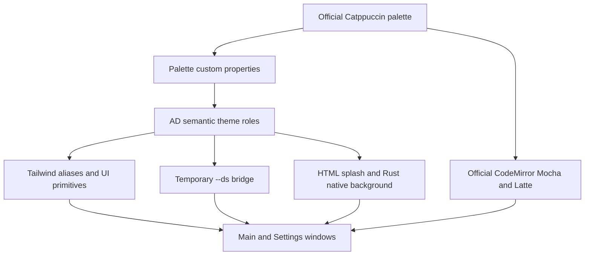

# feat: Adopt the Catppuccin Mocha theme system

## Goal Capsule

- **Objective:** Make Catppuccin Mocha the default AD visual system, retain a Catppuccin Latte light companion, and establish a durable semantic-theme contract for future UI work.
- **Authority:** The user request and `docs/design-docs/theme-system.md` define visual direction; `AGENTS.md`, `docs/CODE_STYLE.md`, and `docs/DESIGN.md` constrain implementation and delivery.
- **Execution profile:** Theme and UI styling change with test-first contract checks, then browser/runtime smoke verification across both windows and both modes.
- **Stop conditions:** Stop if official Catppuccin mappings cannot meet readable interaction states without changing palette values, or if implementation requires removing existing light-mode behavior.
- **Tail ownership:** Complete review, browser QA, production build, branch push, PR creation, and CI follow-up under the LFG pipeline after the repository ExecPlan is approved.

---

## Product Contract

### Summary

AD currently mixes Zinc/Indigo Tailwind aliases, `--ds-*` variables, inline colors, hard-coded overlays, One Dark editor styling, and separate native splash colors. The change replaces this drift with a Catppuccin-based semantic theme system and documents the rules future features must follow.

### Problem Frame

A palette swap alone would improve one screenshot while preserving the underlying inconsistency. The product needs one hierarchy for canvas, panes, surfaces, text, actions, status feedback, focus, CodeMirror, and pre-React native paint. The theme must cover the main window and Settings window without regressing the released light/dark preference or introducing a runtime theming framework.

### Actors

- A1. AD user who expects a coherent, readable desktop UI in the main and Settings windows.
- A2. AD contributor or Agent who needs stable rules for styling new features without inventing colors.

### Requirements

**Theme foundation**

- R1. AD defaults to Catppuccin Mocha and maps the official named palette into stable product semantic tokens.
- R2. Existing light mode remains functional through a Catppuccin Latte mapping with the same semantic roles.
- R3. Sapphire is the primary action and focus accent; Blue represents links, Sky represents information, and Green, Yellow, and Red represent success, warning, and error/destructive states.
- R4. Components consume semantic roles rather than raw Catppuccin names, arbitrary hex values, generic black/white overlays, or framework color scales.

**Surface parity**

- R5. Main window, Settings window, dialogs, drawers, command palette, sidebar, content panes, forms, tables, empty/loading/error states, scrollbars, and overlays use the same theme contract.
- R6. CodeMirror uses the official Catppuccin Mocha and Latte themes while preserving AD's controlled-editor behavior, folding, sizing, and WKWebView layout fixes.
- R7. HTML splash colors and Rust native WebView background colors match the selected React theme so launch and window opening do not flash an unrelated color.

**Quality and memory**

- R8. Keyboard focus remains visible, primary text and controls meet readable contrast, and status meaning never relies on color alone.
- R9. Any touched user-facing labels or accessibility names use synchronized Chinese and English i18n keys.
- R10. The lasting theme contract is recorded as synchronized `docs/design-docs/theme-system.md` and `.html`, indexed for future contributors.

### Scope Boundaries

In scope: theme tokens, Tailwind aliases, the existing component inventory, CodeMirror themes, dark/light persistence integration, splash/native background paint, accessibility states, theme-contract tests, browser QA, and the design-system document.

Out of scope: layout or information-architecture redesign, icon replacement, user-selectable accent colors, additional Catppuccin flavors, plugin-provided themes, profile data colors, and removing light mode.

### Acceptance Examples

- AE1. Given a fresh AD launch, when the main window first paints, then native chrome, splash, sidebar, and React canvas transition within the Mocha hierarchy without a white or Zinc-black flash. Covers R1, R5, R7.
- AE2. Given light mode was persisted, when both main and Settings windows are opened, then both use Latte semantic equivalents and remain synchronized. Covers R2, R5, R7.
- AE3. Given keyboard-only navigation, when focus moves across titlebar actions, navigation, forms, tabs, and dialog controls, then a visible Sapphire focus treatment identifies the active control. Covers R3, R8.
- AE4. Given JSON or TOML content in CodeMirror, when theme mode changes, then syntax, gutter, selection, cursor, fold placeholder, and active line switch to official Catppuccin styling without rebuilding or losing content. Covers R2, R6.
- AE5. Given a contributor adds a future component, when they consult the theme document, then they can choose background, text, action, status, border, and focus roles without copying a raw palette value. Covers R4, R10.

---

## Planning Contract

### Key Technical Decisions

- KTD1. Use a two-layer CSS contract: exact Catppuccin RGB-channel palette variables feed AD semantic variables, which feed Tailwind aliases through `rgb(var(--token) / <alpha-value>)` and the temporary `--ds-*` compatibility bridge. This preserves Tailwind opacity modifiers, makes palette provenance visible, and prevents product components from depending on flavor-specific names.
- KTD2. Use Mocha as the default dark flavor and Latte as the existing light-mode companion. This preserves released behavior and avoids maintaining Catppuccin beside an unrelated Zinc/Indigo light system.
- KTD3. Use Sapphire as the primary accent, Blue for links, and Sky for information. (session-settled: user-directed — chosen over Mauve: the user considers the purple accent too AI-coded and wants a calmer, tool-like identity.) The cool blue family preserves clear interaction hierarchy without collapsing primary actions, links, and information into one color.
- KTD4. Adopt `@catppuccin/codemirror` for syntax highlighting instead of manually translating One Dark. The official package is MIT licensed, small, and already exposes Mocha/Latte CodeMirror 6 extensions.
- KTD5. Keep palette values self-contained in CSS for application chrome and use no runtime theme-generation dependency. First-paint HTML and Rust need deterministic constants before React loads.
- KTD6. Treat raw-color removal as a scoped inventory migration, not a broad component refactor. Layout, component ownership, state management, and Agent behavior remain unchanged.

### High-Level Technical Design

### Assumptions

- Mocha is the requested primary visual identity; Latte exists only to preserve current light-mode parity.
- No new user preference beyond the existing `darkMode` boolean is required.
- Official palette values may be copied into CSS under Catppuccin's MIT license; source attribution remains in the design document.
- Browser/runtime visual evidence is the primary proof for styling units; unit tests protect token and editor behavior contracts but do not replace screenshot inspection.

### System-Wide Impact

End users see a global visual refresh across both windows. Contributors gain a single styling contract and a documented ban on new raw colors. The backend changes only deterministic window background constants and tests; Agent configuration, mutation, filesystem, and conversion behavior stay untouched. Adding the official CodeMirror theme slightly changes the lazy editor vendor chunk but does not move it into the initial bundle.

### Risks & Dependencies

- Weak text/background combinations can arise even with official colors. Mitigation: contract tests fix semantic pairings, while keyboard-focus and screenshot QA inspect every representative surface in both flavors; Overlay colors remain non-critical-only.
- Bulk replacing raw colors may erase meaningful profile/user data colors. Mitigation: the static inventory separates product chrome from values sourced from profile data, and approved dynamic-color exceptions remain documented instead of being normalized.
- WKWebView style injection constraints require retaining existing CodeMirror base layout CSS. Mitigation: U3 changes theme extensions and semantic color overrides only, then reruns controlled-editor behavior and production-bundle smoke checks.
- The current branch is substantially ahead of `origin/main`. Mitigation: before shipping, inspect remote ancestry and create the focused theme branch from the repository's actual integration baseline; never force unrelated commits into the PR.
- Dependency: `@catppuccin/codemirror` current official package line (verified at 1.0.3 during planning). Mitigation: keep it in the existing lazy CodeMirror vendor chunk and retain an isolated rollback path to One Dark until browser QA passes.

---

## Implementation Units

### U1. Establish the palette and semantic token contract

- **Goal:** Replace Zinc/Indigo and Anthropic color foundations with exact Mocha/Latte palette variables and AD semantic aliases.
- **Files:** `src/styles/globals.css`, `tailwind.config.ts`, `tests/styles/themeContract.test.ts`.
- **Approach:** Define exact RGB-channel palette variables, semantic backgrounds/text/borders/actions/status/focus, migrate Tailwind aliases from HSL wrappers to alpha-aware semantic RGB aliases, derive `--ds-*` compatibility variables from those roles, and theme selection, scrollbars, and CodeMirror base chrome without changing layout.
- **Requirements:** R1, R2, R3, R4, R8; KTD1, KTD2, KTD3, KTD5.
- **Test scenarios:** Assert exact official core palette values for both flavors; assert required semantic roles resolve in both modes; assert legacy aliases derive from semantic variables; reject reintroduction of removed Zinc/Indigo/Anthropic literals in the theme foundation.
- **Verification:** Theme contract tests pass and the CSS has one canonical source for each semantic role.

### U2. Align first paint and cross-window theme lifecycle

- **Goal:** Make native window paint, HTML splash, React class state, and persisted mode agree from launch through toggles.
- **Files:** `index.html`, `src/main.tsx`, `src/App.tsx`, `src/SettingsApp.tsx`, `src/store/uiSettings.ts`, `src-tauri/src/lib.rs`, `src-tauri/src/commands/settings.rs`, `src/i18n/locales/zh.json`, `src/i18n/locales/en.json`, `tests/store/uiSettings.test.ts`, `tests/i18n/locales.test.ts`.
- **Approach:** Keep the `darkMode` persistence contract, replace boot colors with Mocha/Latte semantic roots, centralize repeated document-theme application where it reduces drift, and move titlebar accessibility copy through i18n.
- **Requirements:** R1, R2, R5, R7, R9; KTD2, KTD5.
- **Test scenarios:** Default hint resolves to Mocha Base/Chrome; light hint resolves to Latte; persisted mode is applied before React; a toggle updates current document, sibling window storage state, and backend hint; titlebar labels exist in zh/en.
- **Verification:** Rust theme helper tests and frontend store/i18n tests pass; launch smoke shows no wrong-color frame.

### U3. Replace One Dark with official Catppuccin CodeMirror themes

- **Goal:** Give all controlled editors official Mocha/Latte syntax and editor chrome without regressing state synchronization.
- **Files:** `package.json`, `pnpm-lock.yaml`, `src/components/JsonEditor.tsx`, `src/styles/globals.css`, `vite.config.ts`, `tests/components/JsonEditor.test.tsx`.
- **Approach:** Add the official CodeMirror theme package, reconfigure the existing theme compartment between Mocha and Latte, retain WKWebView base layout fixes, and ensure the package remains in the lazy CodeMirror vendor chunk.
- **Requirements:** R2, R6, R8; KTD4.
- **Test scenarios:** Initial dark/light theme extension is selected correctly; toggling reconfigures without remounting or losing document content; user edits and external value synchronization still work; read-only and text-language modes remain intact.
- **Verification:** Component tests and production bundle inspection pass, with the editor theme dependency staying lazy-loaded.

### U4. Migrate product components to semantic interaction states

- **Goal:** Apply the theme consistently across the complete main/Settings UI inventory and remove product-chrome raw colors.
- **Files:** `src/App.tsx`, `src/SettingsApp.tsx`, `src/components/AgentCollectionPanel.tsx`, `src/components/AgentConversionDialog.tsx`, `src/components/AgentConversionRiskDialog.tsx`, `src/components/AgentProfilesDialog.tsx`, `src/components/AgentSelector.tsx`, `src/components/AgentSettingsEditor.tsx`, `src/components/CommandPalette.tsx`, `src/components/ProfileEditDrawer.tsx`, `src/components/ProfileEditor.tsx`, `src/components/ProjectConfigEditor.tsx`, `src/components/ProjectDetail.tsx`, `src/components/ProjectSidebar.tsx`, `src/components/ProjectSkills.tsx`, `src/components/SkillSources.tsx`, `src/components/SkillToggle.tsx`, `src/components/SwitchTemplateDialog.tsx`, `src/components/ui/button.tsx`, `src/components/ui/dialog.tsx`, `src/components/ui/input.tsx`, `src/components/ui/tabs.tsx`, `src/styles/globals.css`, `tests/components/themeSurfaces.test.tsx`, and existing affected `tests/components/*.test.tsx`.
- **Approach:** Audit every file identified by raw-color/token search; replace hard-coded overlays, emerald/black states, clay/olive/rust aliases, inline rgba, and bespoke hover mutations with semantic classes or variables. Preserve user profile color data and avoid layout refactors.
- **Requirements:** R3, R4, R5, R8, R9; KTD6.
- **Test scenarios:** Primary/secondary/ghost/destructive controls expose distinct default, hover, focus, disabled, and loading states; modal overlays, cards, tabs, status pills, forms, empty/error states, and command palette use semantic roles; status meaning retains text/icon cues; existing interaction tests remain green.
- **Verification:** Static inventory finds no unapproved product-chrome raw colors, component tests pass, and browser screenshots cover representative main/Settings/dialog/editor states in both modes.

### U5. Finalize the durable theme guide and delivery proof

- **Goal:** Update the proposed design to match implementation, make it discoverable, and verify the complete application.
- **Files:** `docs/design-docs/theme-system.md`, `docs/design-docs/theme-system.html`, `docs/design-docs/index.md`, `docs/exec-plans/completed/catppuccin-mocha-theme.md`.
- **Approach:** Record as-built token names, component rules, exceptions, visual examples, official sources, and future-feature constraints; keep the approved ExecPlan HTML frozen while updating only its live Markdown progress.
- **Requirements:** R10.
- **Test scenarios:** Every implemented semantic role is documented; no documented token is absent from code; index links resolve; HTML works offline and visually represents Mocha/Latte hierarchy.
- **Verification:** Documentation link audit, full frontend/Rust gates, production Tauri build, browser QA, review remediation, and PR CI all complete.

---

## Verification Contract

| Gate | Applies to | Done signal |
|---|---|---|
| `pnpm test` | U1–U4 | Theme, store, i18n, editor, and existing component tests pass. |
| `pnpm typecheck` | U2–U4 | No TypeScript contract regressions. |
| `pnpm lint` | U1–U4 | No lint warnings or unused migration code. |
| `pnpm build` | U1–U4 | Vite production bundle builds and CodeMirror remains lazy. |
| `cargo test --manifest-path src-tauri/Cargo.toml --all-targets` | U2 | Native theme hint and all existing Rust behavior pass. |
| `cargo clippy --manifest-path src-tauri/Cargo.toml --all-targets -- -D warnings` | U2 | No new Rust warnings. |
| Browser QA in main and Settings windows | U2–U4 | Mocha and Latte screenshots show coherent layers, focus, overlays, status, and editor with no wrong-color first frame. |
| `pnpm tauri build` | U5 | Production `.app` and `.dmg` bundle successfully. |

---

## Definition of Done

- All R1–R10 requirements and AE1–AE5 examples are satisfied.
- Mocha is the default, Latte preserves light parity, and no released theme preference behavior is removed.
- Product UI uses semantic theme roles; approved exceptions are limited to user data colors and explicitly documented dynamic values.
- CodeMirror uses official Catppuccin themes and retains controlled behavior and lazy loading.
- Native, splash, React, main window, and Settings window colors agree.
- Theme documentation MD/HTML is synchronized, indexed, and updated to as-built reality.
- Review findings are applied or durably recorded, a focused branch is committed and pushed, a PR is open, and CI reaches a decided green state or reports durable residuals.

---

## Appendix

### Sources & Research

- Catppuccin repository and design philosophy: <https://github.com/catppuccin/catppuccin>
- Official style guide: <https://github.com/catppuccin/catppuccin/blob/main/docs/style-guide.md>
- Machine-readable palette: <https://github.com/catppuccin/palette>
- Official CodeMirror 6 integration: <https://github.com/catppuccin/codemirror>

External research is load-bearing for KTD1–KTD5: it fixes the palette values, semantic role guidance, available accent roles, editor integration, and license/dependency choice.
