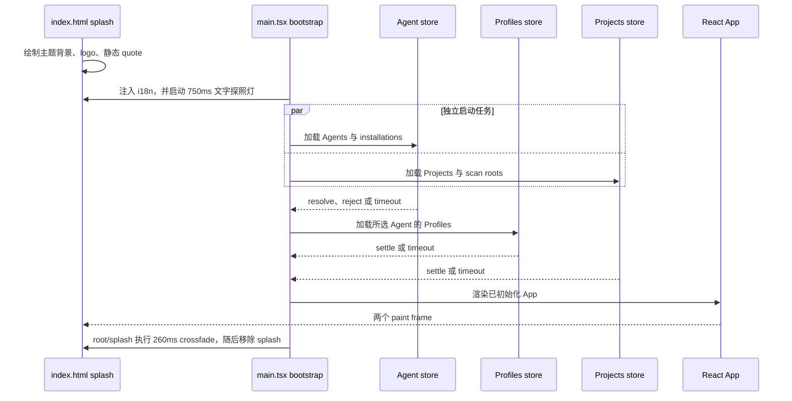

# feat: 添加品牌化启动 Loading

## 目标摘要

- **目标：** 用品牌化 AD Loading 替换过早消失的 skeleton，在首次启动初始化期间持续可见，并在启动任务结束后自然显示主界面。
- **权威来源：** 用户指定 logo、精确文案 “Be Water, My Friend”、文字探照灯与 Loading 到主界面的过渡。`AGENTS.md`、`docs/CODE_STYLE.md`、`docs/DESIGN.md`、`docs/design-docs/theme-system.md` 和已批准的 `docs/exec-plans/completed/branded-startup-loading.md` 共同约束实现。
- **执行方式：** 先写生命周期和静态合同测试，再实现、构建 production 包，并在真实 macOS 冷启动中验证视觉效果。
- **停止条件：** 如果真实冷启动证明主要耗时发生在 WebView 创建前的 Rust migration，或实现需要第二个 Tauri 窗口、延迟主窗口显示、修改 Agent 数据合同或引入第三套主题色，则停止扩展本任务。
- **尾部责任：** ExecPlan 获批后，由 LFG 完成实现、简化、审查修复、浏览器/Tauri QA、提交、推送、PR 与 CI 跟进。

---

## 产品合同

### 概要

AD 已能在 React 之前绘制主题正确的 splash，但旧实现会在 `src/App.tsx` mount 两帧后移除它，此时 Agent discovery、Profiles 和 Projects 仍可能加载。慢速首次启动因此会暴露空白或未完整主界面。本功能把现有 splash 边界升级为明确的品牌启动状态，并让退出条件与真实初始化完成对齐。

### 问题定义

这是体验和生命周期修复，不宣称加载任务本身更快。现有 bundle 计划已经减少首帧 JavaScript，并明确否决“就绪后才显示窗口”。本任务继续立即显示窗口，在不增加人为最短时长的前提下，让不可避免的等待有连续、可信的视觉反馈。

### 参与者

- A1. 等待 AD 发现已安装 Agent 并读取本地状态的首次启动或冷启动用户。
- A2. 需要可读、不过度刺激启动状态的键盘、读屏器或 reduced-motion 用户。

### 需求

**启动生命周期**

- R1. 主 WebView 从第一可见帧起展示非空 Loading。
- R2. 内置 Agent discovery、初始 Profiles、初始 Projects 完成或到达 deadline 前，Loading 始终覆盖应用。
- R3. 独立的 Projects 与 Agent discovery 并行开始；Profiles 依赖选中的 Agent，因此等待 Agent attempt 后开始。
- R4. 所有必要启动尝试 settle 或达到整体 12 秒 deadline 后显示主界面，任何 rejection 或挂起命令都不能造成永久 Loading。超时的幂等 read 可以稍后完成并渐进更新 store。
- R5. 不增加人为最短时长，也不延迟 Tauri 主窗口显示。

**品牌与动效**

- R6. Loading 使用现有 AD 应用 logo 与精确文案 “Be Water, My Friend”。
- R7. normal motion 模式下文字具有清晰的 750ms 探照灯扫过，效果只裁剪在字形内部；非高亮底色在 Mocha/Latte 中全程达到 WCAG AA 4.5:1。reduced-motion 模式静态、完整、可读。
- R8. Mocha 与 Latte 启动色继续与持久化偏好、React canvas、native WebView 背景一致。
- R9. slogan 与无障碍 label 通过同步的中英文 i18n key 提供；两个 locale 的 slogan 都保留用户指定的英文原句。
- R10. 可见构图没有第二行状态文案。唯一 localized `role="status"`、`aria-live="polite"`、`aria-atomic="true"` 区域以非视觉方式传达状态，logo 为装饰图。Splash 与 App 重叠时 `#root` 保持 inert 和 `aria-hidden`；260ms crossfade 完成并移除 splash 后恢复可访问性，不主动移动焦点。

### 范围边界

范围内：现有 HTML splash markup、仅文字探照灯、启动协调、重复 mount load 清理、260ms crossfade、i18n、生命周期/主题合同测试与冷启动 QA。

范围外：启动性能优化、独立 splash window、百分比、可见 “Initializing AD” 或其他第二行状态、轮换 quote、新 logo、后端数据/API 修改、Settings 窗口重设计，以及 active bundle-slim ExecPlan 的改动。

### 验收示例

- AE1. 冷启动且 Tauri 命令延迟时，窗口出现后持续显示 AD logo 与文字探照灯，直到 Agent、Profiles、Projects 的启动尝试结束。覆盖 R1–R3、R6。
- AE2. 初始化成功时，React 绘制完成后 Loading 与主界面执行一次 260ms crossfade，最终只显示 ready 主界面。覆盖 R2、R4、R5、R10。
- AE3. 任一启动命令 reject 时，其余必要尝试 settle 后用英文记录失败并显示主界面，不把用户困在 Loading。覆盖 R4。
- AE4. `prefers-reduced-motion: reduce` 时，slogan 清晰可读且探照灯与 logo 呼吸均停止。覆盖 R7。
- AE5. 已持久化 Latte 偏好时，native paint、Loading 与主 canvas 保持 Latte 层级，无深色或白色闪烁。覆盖 R8。

---

## 规划合同

### 关键技术决策

- KTD1. Splash 保留在 `index.html` 且位于 `#root` 外，继续使用 Rust `on_page_load(Finished)` 显示/聚焦主窗口；ready 只移除 overlay，不抢焦点。
- KTD2. 用一个明确的主窗口 startup coordinator 取代 mount 时 fire-and-forget。Projects 与 Agent discovery 并行，Profiles 等 Agent attempt；Settings route 不执行主窗口初始化。
- KTD3. 按 settlement 或 12 秒整体 deadline 揭幕，而不是只等待成功。Rejection/timeout 返回英文 failure metadata；超时 read 是幂等操作，可以晚到更新。
- KTD4. 使用现有 AD icon 和精确 slogan。（session-settled: user-directed — 用户明确选择品牌 logo + quote，替代匿名 skeleton。）
- KTD5. 首帧 gradient/clip 与 Mocha/Latte 常量保持在 `index.html`；正常模式由 store-free `startupSurface` helper 以 requestAnimationFrame 驱动 750ms 文字 background-position，规避 WKWebView 只绘制 CSS keyframe 首帧的问题。背景不参与探照灯；`prefers-reduced-motion` 停止全部循环动效。
- KTD6. 即使两个 locale 的 quote 值相同，也必须添加 i18n key，遵守用户可见文案合同。
- KTD7. 可见构图仅包含 logo 和 quote。（session-settled: user-directed — 用户明确删除 “Initializing AD”。）唯一不可见 live status 传达加载状态。
- KTD8. React root 淡入与 splash 淡出共享 260ms opacity transition，形成连续 crossfade；splash 移除前 root 继续保持 inert/aria-hidden。

### 高层技术设计

### 假设

- “logo” 指 `src-tauri/icons/` 中现有 AD icon，不创建新 artwork。
- slogan 是固定品牌文案，两个 locale 都保留英文。
- 启动失败沿用现有 store 与 console 行为；首次启动 error/retry 产品流另立任务。
- 探照灯是装饰性等待动效，不表示百分比或预计时长。
- 仓库已有首帧、主题、Loading 与窗口生命周期合同，无需额外外部研究。

### 全局影响

主窗口启动顺序变得明确且可测试；Settings route 继续独立渲染，并通过 store-free surface helper 避免静态带入主窗口 store。改动不改变持久化数据、Tauri commands 或 Rust window builder。`theme-system` 文档记录最终启动状态合同。

### 风险与依赖

- `docs/exec-plans/active/bundle-slim-codemirror.md` 仍有独立的真实冷启动验证，本计划不修改或宣称完成它。
- Rust 在 WebView 前执行首次 migration，HTML 无法覆盖该阶段；若它主导等待，应停止扩展视觉任务。
- React StrictMode 会重复 effect，因此初始协调必须位于 component effects 外，后续 Agent reload 需依赖 store inflight guard。
- Tauri bundle icon 不是稳定 WebView URL；复制为 `public/ad-logo.png`，并以 PNG signature 与 SHA-256 固定其来源。
- gradient-to-transparent 在不支持 clipping 时可能不可读；始终保留满足对比度的 base foreground，并只在 feature detection 内应用 clipping。
- requestAnimationFrame loop 只在 splash 存在时继续；节点移除后停止排帧。

---

## 实现单元

### U0. 确认慢点位于 WebView 生命周期内

- **目标：** 在实现前证明 HTML Loading 可以覆盖用户感知的慢区间。
- **文件：** 不改产品文件；证据记录到 live ExecPlan。
- **方法：** 对 packaged/current app 做冷启动检查，区分 process start、首个 WebView frame 与 ready UI。无法可靠自动采集窗口毫秒时，不伪造数据，以用户复现与静态时序证明决定是否继续。
- **需求：** R1–R2；KTD1。
- **验证：** 证据写入 live ExecPlan；若 pre-WebView migration 明显主导则停止。

### U1. 定义并测试 startup coordinator

- **目标：** 建立确定、独立可测的启动顺序与失败策略。
- **文件：** `src/lib/startup.ts`、`tests/lib/startup.test.ts`。
- **方法：** 使用可注入/default loaders 与 12 秒 deadline。Agent/Projects 并行，Profiles 等 Agent attempt；三项完成或 deadline 后返回结构化 rejection/timeout 上下文，不负责视觉动画。
- **需求：** R2–R5；KTD2、KTD3。
- **测试：** 并发与依赖顺序、单项/多项 rejection、永不 resolve、deadline、late idempotent update、每个 loader 只调用一次。
- **验证：** focused test 先红后绿，不依赖 Tauri。

### U2. 把初始化接入 main bootstrap

- **目标：** 从初始化状态渲染主 App，并移除重复的 component mount loading。
- **文件：** `src/main.tsx`、`src/App.tsx`、`src/hooks/useReloadProfilesOnAgentChange.ts`、`src/components/AgentSelector.tsx`、`tests/main.test.tsx`、hook tests。
- **方法：** App chunk import 与动态 startup coordinator 并行；Settings 仅加载 store-free `startupSurface`。协调结束后 render，再执行 reveal。删除初始 `useLoadAgents` 与 Profiles/Projects mount effects，用独立 hook 保留 Agent 变更后的 Profiles reload，并处理 rejection。
- **需求：** R2–R5、R9–R10；KTD1–KTD3、KTD6–KTD8。
- **测试：** Settings 跳过 coordinator；main 等 startup 后 render/reveal；相同 Agent 不 reload，Agent 变化只 reload 一次；rejection 不产生 unhandled promise；splash 覆盖时 root inert/hidden，揭幕后恢复。
- **验证：** startup、bootstrap、hook、store tests、typecheck、lint 全绿。

### U3. 构建品牌化、可访问的首帧 Loading

- **目标：** 用 logo、精确 quote 与只作用于文字的探照灯替换匿名 skeleton，不破坏主题首帧。
- **文件：** `index.html`、`public/ad-logo.png`、`src/lib/startupSurface.ts`、zh/en locale、theme/i18n/startup tests。
- **方法：** 复制现有 128px icon；居中显示 logo 与 quote；以 Mocha/Latte semantic colors 和 feature-gated text clipping 定义高光，surface helper 每 750ms 驱动 background-position；root 与 splash 以 260ms crossfade 揭幕。添加不可见 status、reduced-motion 和不支持 clipping 的 fallback。不增加最短 timer 或可见状态 caption。
- **需求：** R1、R5–R10；KTD1、KTD4–KTD8。
- **测试：** 装饰 logo、单一 polite/atomic status、i18n hook、无背景探照灯、750ms helper、260ms crossfade、双主题、reduced motion、4.5:1 对比度、PNG signature 与源 icon SHA-256 一致。
- **验证：** focused tests 与 `pnpm build` 通过，built HTML/asset 包含品牌 Loading。

### U4. 验证冷启动并同步持久设计记忆

- **目标：** 在 packaged macOS build 中证明生命周期，并记录最终行为。
- **文件：** `theme-system.md/.html`、live ExecPlan，完成后归档 ExecPlan pair。
- **方法：** 检查 normal/delayed startup、Mocha/Latte、reduced motion、failure settlement 与 Settings。更新既有 theme-system，保持已批准 ExecPlan HTML 冻结，只更新 MD progress。
- **需求：** R1–R10；AE1–AE5。
- **测试：** 无空白/错误色；文字探照灯逐帧移动；reduced motion 静态；必要 load 完成后才显示主界面；failure 不永久 Loading；Settings 正常。
- **验证：** frontend gates、production Tauri build、视觉检查、文档一致性与 plan archival 完成。

---

## 验证合同

| 门禁                                                                                                                                                                          | 适用范围 | 完成信号                                                                                       |
| ----------------------------------------------------------------------------------------------------------------------------------------------------------------------------- | -------- | ---------------------------------------------------------------------------------------------- |
| `pnpm test -- tests/lib/startup.test.ts tests/styles/themeContract.test.ts tests/i18n/locales.test.ts tests/main.test.tsx tests/hooks/useReloadProfilesOnAgentChange.test.ts` | U1–U3    | lifecycle、bootstrap、hook、inert/aria、对比度、首帧、reduced-motion、asset、locale 合同通过。 |
| `pnpm test`                                                                                                                                                                   | U1–U3    | 现有前端行为保持全绿。                                                                         |
| `pnpm typecheck`                                                                                                                                                              | U1–U3    | Bootstrap 与 store 调用保持类型安全。                                                          |
| `pnpm lint`                                                                                                                                                                   | U1–U3    | 无 hook、Promise 或 unused-code 回归。                                                         |
| `pnpm build`                                                                                                                                                                  | U2–U3    | production Vite 资产包含 logo 与品牌 splash，Settings 不静态导入 startup stores。              |
| `pnpm tauri build`                                                                                                                                                            | U4       | 生成 production macOS `.app` 与 DMG。                                                          |
| 真实 macOS 冷启动 QA                                                                                                                                                          | U4       | normal/reduced-motion 启动先显示 Loading，再平滑显示 UI，无空白或永久 Loading。                |
| LFG browser QA 与 review                                                                                                                                                      | U4       | 自动 UI 检查与代码审查无未解决 actionable finding。                                            |

---

## 完成定义

- R1–R10 与 AE1–AE5 全部满足。
- 慢启动期间显示现有 AD logo 与精确 “Be Water, My Friend” 文字探照灯。
- Splash 跟随真实 initialization settlement，无人为延迟，不会因命令失败永久存在。
- 启动任务按正确依赖顺序执行一次；移除重复 App mount load，并保留可靠的 Agent 切换 reload。
- Mocha、Latte、reduced-motion、i18n、asset packaging 与 production cold launch 已验证。
- Theme 设计记忆同步到最终实现；ExecPlan pair 归档；review finding 已修复或记录；PR 已打开且 CI 达到明确状态。

## 附录

### 来源与研究

- `index.html` 与 commit `f9f1065` 定义现有主题正确的 pre-React splash；`src-tauri/src/lib.rs` 负责可靠的 `on_page_load(Finished)` 主窗口显示。
- 旧 `src/App.tsx` 在三组 startup store 仍异步加载时，两帧后就移除 splash。
- `docs/exec-plans/active/bundle-slim-codemirror.md` 把 bundle 优化定义为独立工作，并否决 deferred-show。
- `docs/design-docs/theme-system.md` 要求 native、HTML splash、React theme parity 与 reduced-motion。
- `tests/styles/themeContract.test.ts` 是首帧主题常量的现有静态守卫。
