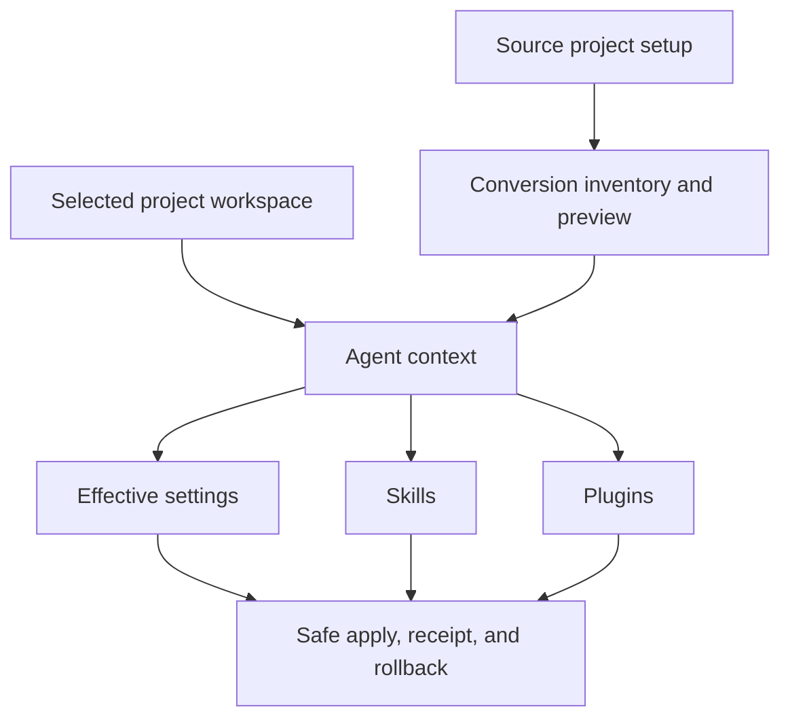
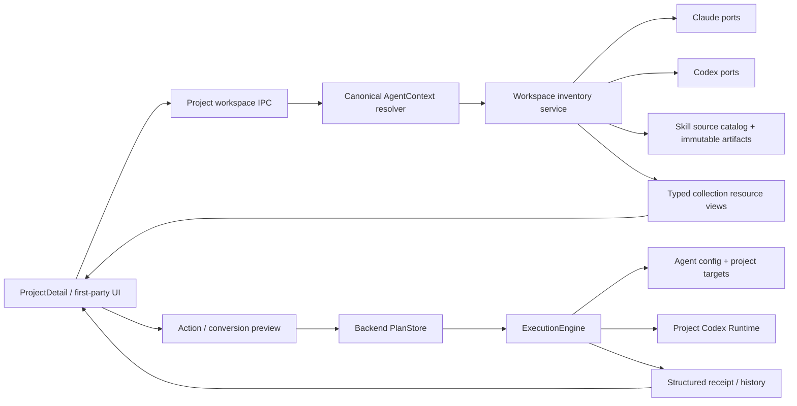
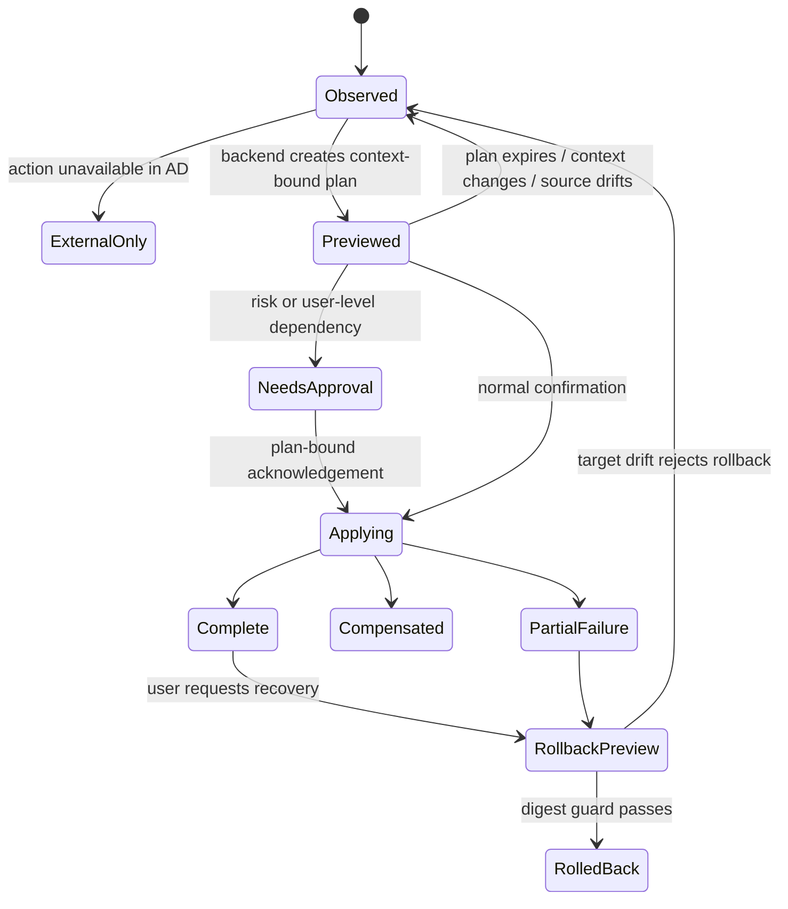
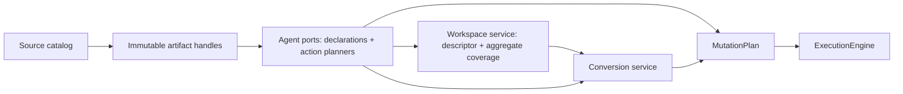

# Project Agent Workspace - Plan

## Goal Capsule

- **Objective:** 让 AD 成为以项目为边界的本地 Coding Agent 配置管理器，完整呈现并管理项目实际使用的 Settings、Skills、Plugins，并把 Claude Code → Codex 转化收进同一个安全、可验证的项目工作区闭环。
- **Product authority:** 用户给出的产品目标是最高产品约束；`docs/PRODUCT_SENSE.md` 提供数据安全与简洁性原则，`docs/product-specs/multi-agent-support.md` 提供现有多 Agent 行为基线。
- **Open blockers:** 无需求级阻塞项；规划必须先核实现有资源覆盖和 legacy 路径，再决定迁移顺序。

---

## Product Contract

### Summary

AD 将围绕“一个项目的 Agent 配置环境”组织产品。
用户在同一项目工作区内查看有效配置、管理 Skills 与 Plugins，并把 Claude Code 项目配置转化为隔离的 Codex 项目环境。

### Problem Frame

AD 已从 Claude Code Profile 管理器扩展为 Claude Code 与 Codex 的多 Agent 应用，但“已实现”缺少统一的产品完成标准。
现有项目资源页已经能列出和启停 Skills、Plugins，后端也具备项目上下文、安全执行和部分安装能力，但来源管理、安装入口、退化能力和转换结果仍分散在不同流程中。
这使功能是否真正完成难以判断：代码入口、规格状态和用户可完成的任务并不总是一致。

### Key Decisions

- **项目工作区是产品中心。** 选择项目工作区而不是继续扩张抽象能力矩阵，使 Settings、Skills、Plugins 和 Conversion 共享一个用户目标。Governs R1–R5, R10–R14.
- **以用户任务闭环作为完成度单位。** (session-settled: user-approved — chosen over page or module inventory: code presence does not prove that a user can finish the job.) Governs R15–R17.
- **完成度使用分级证据。** (session-settled: user-approved — chosen over a binary done/not-done label: risky writes need stronger proof than read-only views.) Governs R15, R16.
- **项目风险决定验证门槛。** (session-settled: user-approved — chosen over one uniform threshold: conversion and configuration writes require recovery evidence.) Governs R5, R14–R16.
- **内建 Agent 能力可以不同，但产品状态必须完整。** AD 不伪造平台没有的操作；它必须把每项资源标成可管理、只读观察、需要外部操作或不支持。Governs R2, R8, R9.

### Actors

- A1. **本地开发者 / 项目负责人：** 选择项目和 Agent，决定项目应使用的配置、Skills 与 Plugins，并审核转换结果。
- A2. **内建 Agent adapter：** 解释 Claude Code 或 Codex 的公开配置格式、作用域、来源和真实可用操作。
- A3. **AD 安全执行层：** 在项目边界内完成预览、备份、写入、结果记录和回滚。

### Requirements

**Project workspace and isolation**

- R1. 每个项目必须有一个由项目路径与所选 Agent installation 共同确定的工作区，Settings、Skills、Plugins 和 Conversion 都使用该上下文。
- R2. 工作区必须列出所有会影响该项目的可发现 Settings、Skills 与 Plugins，并显示 Agent、作用域、来源、有效状态和管理状态。
- R3. 用户级继承、项目级声明和项目级覆盖必须在工作区中可区分，最终生效状态不得要求用户自行推断。
- R4. 项目操作不得修改另一个项目；任何会触及用户级资源的受支持依赖必须在预览中单独说明并取得确认。
- R5. 所有项目写操作必须经过预览、确认、结果回执和可用时的回滚；失败不得被显示为成功。

**Skills and Plugins**

- R6. AD 必须为项目 Skills 提供统一生命周期：发现来源、查看内容与状态、添加或安装、启用或禁用、重新同步或更新、从项目移除。
- R7. AD 必须为项目 Plugins 提供同等可理解的生命周期，并展示 marketplace、包来源、继承关系和项目覆盖。
- R8. AD 无法直接执行某项生命周期操作时，资源仍必须出现在清单中，并标记为只读观察、需要外部操作或不支持，同时给出下一步。
- R9. 单项资源的错误或退化能力不得隐藏同类其他资源；用户必须能识别失败项、成功项和未处理项。

**Project conversion**

- R10. Claude Code → Codex 项目转化必须以当前项目工作区为目标，盘点该项目所有 AD 可管理的 Settings、Skills 与 Plugins，而不是只生成单个配置文件。
- R11. 每个转化项必须得到唯一最终状态：已映射、无需变更、需要用户决策、不支持或冲突。
- R12. 需要用户决策的转化项必须提供真实可执行的解决动作；没有解决动作的项目不得伪装为等待输入。
- R13. 重复运行转化必须识别 AD 已管理的目标并执行重校验，不得重复安装或静默覆盖外部修改。
- R14. 转化源必须保持只读；目标变更必须使用与项目资源管理相同的备份、冲突检测、补偿、回执和回滚保证。

**Product control and completion evidence**

- R15. 每个核心用户任务必须记录完成证据等级：已声明、用户入口可达、自动化验证通过、真机闭环通过、发布验证通过。
- R16. Skills、Plugins 或 Conversion 只有达到与风险匹配的证据等级才能标记完成；涉及写盘和转化的任务必须包含失败恢复和项目隔离证据。
- R17. README、产品规格、设计索引和功能状态必须使用同一产品目标与能力状态；退化或外部操作不得写成已实现的完整管理。

### Key Flows

- F1. **Inspect a project workspace**
  - **Trigger:** A1 选择项目与 Claude Code 或 Codex installation。
  - **Actors:** A1, A2
  - **Steps:** AD 解析项目上下文，汇总项目资源与会影响项目的继承资源，并显示有效状态和限制。
  - **Outcome:** 用户无需查看多个配置目录即可知道项目实际使用什么。
  - **Covers R1–R3, R8, R9.**
- F2. **Manage a Skill or Plugin**
  - **Trigger:** A1 添加、启停、更新、同步或移除一个项目资源。
  - **Actors:** A1, A2, A3
  - **Steps:** AD 解析真实操作能力，生成预览，应用已确认变更，并刷新项目有效状态。
  - **Outcome:** 资源变化留在所选项目边界内，用户得到可解释结果和恢复入口。
  - **Covers R4–R9.**
- F3. **Convert a project setup**
  - **Trigger:** A1 从当前 Claude Code 项目发起 Codex 转化。
  - **Actors:** A1, A2, A3
  - **Steps:** AD 盘点源资源，为每项生成状态和必要决策，预览隔离目标后执行安全计划。
  - **Outcome:** Codex 项目工作区得到可管理的配置环境，Claude Code 源保持不变。
  - **Covers R10–R14.**
- F4. **Switch project context**
  - **Trigger:** A1 从项目 A 切换到项目 B，或切换 Agent installation。
  - **Actors:** A1, A2
  - **Steps:** AD 使旧预览和旧操作上下文失效，并重新加载新上下文的有效资源。
  - **Outcome:** 项目 A 的待处理状态和变更不能串入项目 B。
  - **Covers R1, R4, R13.**

### Acceptance Examples

- AE1. **Covers R1–R5.** Given 项目 A 与项目 B 使用同名 Skill，when 用户只在项目 A 禁用该 Skill，then 项目 B 和用户级资源保持不变，预览与回执都只引用项目 A。
- AE2. **Covers R2, R3, R7.** Given 一个 Plugin 来自用户级继承且项目有覆盖，when 用户打开项目工作区，then AD 同时显示来源、覆盖和值得信任的最终生效状态。
- AE3. **Covers R7–R9.** Given Claude Code Plugin 的安装不能由 AD 安全执行，when 用户查看或尝试管理该 Plugin，then AD 将它标为需要外部操作并保留可用的项目启停管理，不显示安装成功。
- AE4. **Covers R10–R12.** Given 转化包含可映射 Skill、需要决策的 Plugin 和不支持字段，when 预览完成，then 三类项目分别显示最终状态；安全子集可以在明确审核后执行，但整体结果不得标成无保留完成。
- AE5. **Covers R11, R13.** Given AD 已完成一次项目转化，when 用户对未变化的源再次预览，then 已管理目标显示为无需变更或重校验，不产生重复安装。
- AE6. **Covers R5, R14.** Given 多文件转化在写入中失败，when 补偿成功或只能部分恢复，then Claude Code 源字节不变，回执准确区分 compensated 与 partial failure，并给出安全恢复动作。
- AE7. **Covers R4, R13.** Given 用户在项目 A 生成预览后切换到项目 B，when 用户尝试应用旧预览，then AD 拒绝应用并要求在项目 B 重新预览。
- AE8. **Covers R15–R17.** Given 文档把配置转化标为完成，when 审核完成证据，then 必须能追溯到自动化验证、真机项目闭环和失败恢复证据；缺少任一风险必需证据时状态降级。

### Completion Evidence

| Level | Meaning | Product use |
|---|---|---|
| Declared | 规格或计划描述了任务 | 不能宣称完成 |
| Reachable | 用户入口和后端能力存在 | 只能宣称已实现骨架 |
| Automated verified | 关键正常、边界和失败路径有自动化证据 | 低风险只读能力可进入候选完成 |
| Workflow verified | 在隔离项目和真实 macOS 应用中走通完整任务 | 普通项目能力可标记完成 |
| Release verified | 发布构建通过跨项目隔离、写盘恢复和回归验证 | 高风险配置与转化能力可标记完成 |

### Success Criteria

- Claude Code 与 Codex 的项目工作区都能完整列出有效 Settings、Skills 与 Plugins；每项都有明确来源、作用域和管理状态。
- 项目级资源操作通过跨项目隔离验证，未出现对其他项目或未确认用户级资源的写入。
- Skills 和 Plugins 的生命周期在一个工作区内闭环；平台不支持的动作有明确外部路径，不产生假成功。
- Claude Code → Codex 转化覆盖项目 Settings、Skills 与 Plugins，并通过重复执行、冲突、故障补偿和回滚验证。
- 所有高风险核心流程达到 Release verified；文档状态与证据等级一致。

### Scope Boundaries

**Deferred for later**

- Codex User Plugin 的完整 marketplace acquisition；当前工作只要求项目工作区正确呈现其继承影响和外部操作边界。
- Claude Code → Codex 之外的新增转化方向；它们应复用本计划定义的项目工作区和转化状态契约。
- 团队共享、云同步和远程项目配置分发。

**Outside this product's identity**

- 用户自定义或动态加载 Agent adapter；AD 只支持内建、可验证的 Agent 集成。
- auth、token、session、chat history、logs 和数据库等敏感运行时数据管理。
- 通用文件管理器、Agent 执行编排器，以及 Windows 或 Linux 客户端。

### Dependencies and Assumptions

- “管理项目的所有 Skills 和 Plugins”指支持的内建 Agent 通过公开配置与可发现位置暴露、且会影响所选项目的全部资源，包括用户级继承资源。
- Agent 平台不允许 AD 安全执行的操作可以保持外部完成，但不能从项目清单中消失。
- Claude Code 与 Codex 是本工作单元的验收 Agent；未来 Agent 不改变项目工作区的产品契约。
- 现有 capability ports、安全 ExecutionEngine 和 Project Codex Runtime 是可复用基础，但其存在不构成功能完成证据。

### Sources and Research

- `docs/PRODUCT_SENSE.md` — 产品定位与数据安全、可发现性原则。
- `docs/product-specs/multi-agent-support.md` — 当前多 Agent 能力、隔离、安全和转化声明。
- `docs/design-docs/architecture.md` — AgentContext、capability ports 与安全执行边界。
- `docs/design-docs/agent-conversion-workbench.md` — 现有转化 artifact、resolution 和 source-read-only 契约。
- `src/components/ProjectDetail.tsx` 与 `src/components/AgentCollectionPanel.tsx` — 当前项目工作区与资源管理入口。
- `src/components/ProjectSkills.tsx` 与 `src/store/skills.ts` — 仍存在但未挂载到主项目工作区的 legacy Skills 路径。
- `src-tauri/src/agents/claude_ports/`、`src-tauri/src/agents/codex_skills.rs`、`src-tauri/src/agents/codex_plugins.rs` — 当前 Skills/Plugins 支持范围与退化能力。
- `src-tauri/src/agents/conversion_route.rs` 与 `src-tauri/tests/conversion_execution.rs` — 项目转换的资源路由、source read-only 约束和项目隔离验证。

---

## Planning Contract

### Product Contract Preservation

Product Contract preservation: unchanged. 本轮只补充实施边界、技术决策、执行单元和验证合同，不改变上游 brainstorm 已确认的 R1–R17、F1–F4、AE1–AE8 语义与编号。

### Implementation Posture

本计划覆盖完整 brainstorm 范围，并把 legacy/new 双轨收敛作为实现 Project Agent Workspace 的必要迁移工作。实现从后端项目工作区合同开始，先让资源归属、继承、有效状态和单项动作成为可信数据，再开放安装、更新、移除等 UI 动作。Product Contract 中“管理 Settings”的目标在 U8 具体化为项目层查看、分层编辑、Preview、Apply、report/receipt 与可用时 rollback 的完整闭环；这是对 R1–R5、R10、R14 的实施细化，不新增产品范围。Skills、Plugins 与 Conversion 统一使用同一个 `AgentContext`、安全计划、回执和项目历史。

测试范围覆盖 Claude Code 与 Codex 的项目 A/B 隔离、继承与覆盖、Skill source 更新、Codex Project Runtime、转化重放、补偿和 guarded rollback。外部 CLI、MCP 或 Agent 自动操作 AD 不在本轮实现内。

### Assumptions

以下取舍因用户要求使用默认值并跳过进一步范围确认，保持为显式、可审查的实施假设：

- `~/.ad/skill-library/` 继续承担 Git/local source catalog 与 acquisition cache；项目实际使用的 AD-managed Skill 改为引用不可变、按 digest 标识的 artifact，而不是直接引用会被原地更新的 checkout。
- 现有 `fs/git.rs` 的 shell-string调用和 legacy source id/path 规则不视为可复用安全边界；新 acquisition 必须先改为 shell-free argv、后端生成 opaque id、受控 transport/ref 与 containment validation。
- “从项目移除”只删除 AD 拥有的项目声明、symlink、runtime package 或 override。继承的用户资源和外部资源只能产生项目覆盖、禁用、外部操作指引或 unsupported，绝不删除用户级来源。
- `SkillSourcesSection` 在迁移期保留为 source catalog 入口，但其直接 Git 写操作要收进安全预览和回执；未挂载的 `ProjectSkills`、project allowlist/blocklist 和 legacy Plugin toggle 不再扩展。
- Codex Project Runtime 未准备完成时，项目 Plugin 写操作 fail closed；不得回退为修改 base `~/.codex/config.toml`。
- Claude Plugin install 与 Codex User Plugin marketplace acquisition 保持 external/degraded；“管理完整”由可发现性、真实动作矩阵和明确下一步保证，而不是伪造平台能力。
- 本轮只支持第一方 Tauri UI 发起和批准写操作。被管理的 Claude Code/Codex、adapter 与 ExecutionEngine 都不被视为独立批准者。
- 本轮不为第三方 Skill/Plugin 提供运行时沙箱，也不把内容 digest 当作发布者身份认证；AD 负责来源、revision、内容与激活影响可见并要求知情确认。发布者信任与撤销属于未来独立安全计划。
- 仓库没有可复用的 `docs/solutions/` 经验库；计划决策以当前代码、现有设计文档和测试为依据，不声称存在未找到的历史最佳实践。

### Key Technical Decisions

- **KTD1 — 引入后端签发的 Workspace Descriptor 与项目资源视图，停止让 UI 拼装 context 或解析不透明 snapshot。** `ResourceSnapshot` 继续作为 adapter/conversion 的原始观察；后端 descriptor 包含 canonical project、base/effective installation、Project Runtime identity 与 opaque revision，inventory/preview/apply/rollback 都携带同一 workspace key。Skills/Plugins IPC 返回严格类型的 inventory envelope 与 collection resource view，包含 category coverage、declarations/provenance、effective state、ownership、health、management status、item actions、risk signals、next step 和 item error。选择后端签发而不是继续让 `projectCodexRuntime.ts` 决定安全身份，因为继承、runtime generation、扫描完整性和 stale claim 必须在一个可信边界内。Governs R1–R5, R7–R9; F1, F2, F4; AE1–AE3, AE7.
- **KTD2 — 项目工作区默认只观察继承用户资源，项目写入必须拥有项目化落点。** 后端 workspace policy 在生成动作和 claim plan 时同时校验 canonical project path、installation、scope 与 target ownership；真实路径和 symlink alias 必须解析为同一 context identity。用户级写入只能从明确的 user workspace 发起；项目页不能借 Agent 级 capability 直接修改全局 Skill 或 base Codex Plugin。选择后端 fail-closed 而不是仅禁用前端按钮，因为 stale UI 或直接 IPC 仍可能越界。Governs R1, R3–R5; F1, F2, F4; AE1, AE2, AE7.
- **KTD3 — Skill acquisition 与项目采用分层：受控 source acquisition、规范 tree manifest、immutable artifact、项目级引用。** Source先复制到唯一staging，拒绝逃逸链接/特殊文件并对相对路径、节点类型、权限/执行位、内容和symlink target生成规范digest；stage复验后原子发布，已存在digest必须完整复验且永不原地修改。Git launch先用不含用户输入的固定login-shell probe解析可信git绝对路径与最小allowlisted环境，再用结构化argv执行；URL/ref永不插值进shell。项目update/resync通过MutationPlan只retarget当前项目的ownership-recorded link。Source remove与artifact物理删除分离；本轮不做artifact GC，rollback-eligible receipt持有pin。Governs R4, R6, R13, R14; F2; AE1, AE5, AE6.
- **KTD4 — lifecycle action 是单项策略，不是 Agent 级布尔 capability。** 公共 action vocabulary 覆盖 inspect、add-to-project/install、enable、disable、update/resync、remove-from-project、reset-override、reveal/external-steps、preview、apply、rollback；每个 resource view 对每项动作返回 supported、degraded、external 或 unsupported 及原因。adapter 只生成计划，所有写盘继续由 ExecutionEngine 完成。选择 item-level policy 以保留 Claude/Codex 差异并防止 capability descriptor 误授权。Governs R6–R9; F2; AE3.
- **KTD5 — Preview 必须展示真实落点、依赖和 activation impact，Apply/rollback 必须绑定当前 workspace 与 risk-set fingerprint。** Public plan view 在不暴露正文和私有digest的前提下展示target location、scope、user/read-only dependencies、source revision、agent instructions、hooks/MCP/commands、scripts/binaries、permission变化和风险diff；approval绑定plan id、public-plan revision、workspace key和risk fingerprint，单次使用。Rollback不是直接receipt动作，而是新的inverse MutationPlan，重新检查artifact、backup、ownership、current target和fresh acknowledgement。Governs R4, R5, R14; F2–F4; AE6, AE7.
- **KTD6 — 执行回执与产品操作报告分层。** Versioned `OperationReceipt` 只记录实际attempted mutations的applied、unchanged、compensated、failed、skipped、workspace/action identity、backup/artifact pin和rollback eligibility；`WorkspaceOperationReport`/`ConversionReport`包装零或一个receipt，并记录external、unsupported、conflict、no-change和residual。历史读取采用per-file versioned decoder：当前legacy receipt继续可列出，缺少新证据时明确rollback unavailable，单个损坏或未来版本不影响其他历史项。选择分层而不是让ExecutionEngine理解conversion/catalog语义，以保持单向依赖并让R9与完成证据可机器判读。Governs R5, R9, R11–R16; F2, F3; AE4, AE6, AE8.
- **KTD7 — Conversion 保留现有 route，但改为复用 workspace inventory 与 lifecycle planners。** 转换输入是 Claude 项目的最终有效环境，包括 user/shared/local/project Settings 与 inherited/project Skills/Plugins；所有 source layers 只读，映射结果只写 Codex project runtime/overlay，Codex user config 仅作为继承输入。Settings/Skills/Plugins inventory、真实 resolution、target plan、receipt 和 rollback 仍保持分阶段；没有可执行 resolver 的 `requires_input` 降为 external/unsupported，不显示虚假等待。选择收敛现有引擎而不是另建转换服务，以保留 source read-only、Project Runtime staging 和补偿测试。Governs R10–R14; F3; AE4–AE7.
- **KTD8 — legacy reconciliation分为前置只读发现与后置退役。** U2先用纯只读loader枚举source/project state、内嵌project path、slug collision、path alias、真实link与ownership候选；冲突resource在U3开放写动作前被阻止。U6只负责成功receipt后的versioned archive、direct-write API/UI删除和长期只读decoder。Legacy `is_ad_managed_symlink`只作为discovery hint，不能授权delete/replace；模糊项保持external或要求显式adoption preview。Governs R1, R4–R6, R13, R17; F1, F2; AE1, AE5.
- **KTD9 — 本轮无公共 CLI/MCP/automation API，风险批准保持first-party explicit confirmation。** 未来自动化只能复用同一workspace、inspect/preview/result合同，并要求独立人类批准；不得创建automation-only workspace或一键convert-and-apply。本边界防止产品主动提供self-approval路径，但不声称抵抗已被攻陷的renderer或同一macOS用户自动化；若需OS-level user presence必须另立安全计划。Governs R5, R14, R17.
- **KTD10 — Settings 使用 backend-owned effective view 与分层编辑。** Adapter 解释 Claude user/shared/local 与 Codex base/project overlay 的优先级、最终值和 provenance；项目工作区默认只编辑 project layer，user layer 为 inspect-only，除非用户显式切换到 user workspace。选择语义化分层视图而不是前端通用 JSON merge，以保留未知字段并防止错误覆盖。Governs R1–R5, R10, R14; F1, F3, F4; AE2, AE4, AE7.
- **KTD11 — Domain依赖严格单向，AD-owned state不是伪装的Agent资源。** Source catalog只产出immutable artifact handles；Agent ports产出Agent-specific declarations、precedence和action plans；Workspace service签发context并聚合coverage/catalog；Conversion只消费source inventory和target planners；ExecutionEngine只消费MutationPlan。MutationPlan使用backend-only sealed target enum区分`AgentResource`与allowlisted `AdStateResource`；core resolver只接受由后端构造的catalog、staging、artifact、archive、journal、backup与receipt identity，不接受frontend path，也不把它们绑定到虚假Claude/Codex installation。Adapter不得回调workspace/conversion，ExecutionEngine不得理解marketplace或resolution。Governs R1–R14.
- **KTD12 — 逻辑resource、declaration与物理target使用不同身份。** Effective `ResourceKey`保留同名不同来源，`DeclarationKey`标识user/shared/local/marketplace层，ExecutionEngine的physical `ResourceRef`只指向明确target；action必须同时引用effective resource和owned declaration/target，禁止仅按name删除或覆盖。Governs R2–R9; F1, F2; AE1–AE3.
- **KTD13 — 安全执行增加fd-relative target confinement、跨进程锁和crash journal。** Backend分别为canonical project root、Project Runtime root与backend-managed AD data roots打开并持有受信directory descriptor；后续目录遍历、创建和rename使用macOS `openat`/`renameat`类no-follow调用相对执行，避免检查后ancestor被外部进程替换。Canonical physical targets使用跨进程advisory lockfile并按稳定顺序获取，startup recovery另持全局recovery lock；锁内重验preconditions与root identity，不兼容旧实例或过宽/非当前用户AD root直接fail closed。写盘前持久化prepared→applying→committed/compensated journal，Tauri setup在mutation IPC可用前恢复或生成durable repair-required result。选择显式journal/locks是因为进程崩溃、多实例与外部path race无法由内存补偿或plan replay guard覆盖。Governs R4, R5, R13, R14; F2–F4; AE1, AE6, AE7.
- **KTD14 — Project Codex Runtime是versioned derived projection。** Runtime identity由canonical project path + base installation生成抗碰撞稳定key；base config、versioned manifest overlay和ownership record是provenance，generated runtime config只用于materialization/health，不回流为declaration。Known old manifest通过preview/plan升级，unknown future或损坏manifest只读并阻止写入。Governs R1–R5, R7, R10–R14; F1–F4; AE1, AE2, AE5–AE7.
- **KTD15 — Settings 与持久化证据使用统一敏感数据合同。** Adapter把credential、token、MCP env与未知疑似敏感值标为sensitive；它们默认只作为read-only dependency，不从user scope自动复制到project scope。Inventory、diff、错误与History默认遮罩，journal/receipt只存path、状态和摘要；必要backup使用仅当前用户可读权限并按rollback pin保留，失去pin后才进入未来清理策略。选择显式分类和默认不复制，而不是让Conversion或React猜敏感字段。Governs R2, R4, R5, R10, R13, R14; F1, F3; AE2, AE4, AE6, AE7.

### High-Level Technical Design

下图是边界和数据所有权草图，不是对具体 Rust 类型签名或 React 组件拆分的强制规定。

数据流遵循四条不变量：

1. Adapter 观察并规划，但不写盘。
2. Workspace inventory 决定 effective/provenance/ownership；前端不从 raw content 猜语义。
3. Plan 在 preview 和 apply 两次绑定同一个 canonical context、source revision 和 target precondition。
4. Conversion 与单项资源操作共享 planner、ExecutionEngine、receipt/history；转换源始终是 read-only dependency。

模块依赖固定为单向链，禁止反向调用：

ExecutionEngine 不理解 marketplace、catalog 或 conversion resolution；adapter 不回调 workspace/conversion；generated Codex runtime config 不回流为 provenance。

### System-Wide Impact

- **IPC and schemas:** Rust serde DTO、TypeScript Zod、Tauri wrapper 和 capability helpers 同步演进；严格 schema 测试防止两端漂移。
- **Persistence:** 新增 immutable Skill artifact 和迁移标记；保留旧 source registry 的兼容读取。任何旧 project state 的清理必须在成功建立 native target 与 receipt 后发生。
- **Agent adapters:** Claude Skills/Plugins 与 Codex Skills/Plugins 都要输出 declarations、effective winner 和 ownership；共同用户任务对齐，但不强迫平台拥有相同 install 能力。
- **Execution:** Plan view、claim、journal、receipt/report和history增加workspace/dependency/result信息；既有备份与补偿继续复用，rollback改为fresh inverse plan并受artifact/backup pin和risk acknowledgement保护。
- **Project Codex Runtime:** manifest 继续作为 Project Plugin ownership 与 provenance 权威；generated config 不再被当作唯一来源。runtime 未准备时禁止项目 Plugin 写入。
- **Frontend state:** ProjectDetail、resource panel、conversion dialog、history 都从同一 workspace identity 读取；context 变化立即清空或显式 stale 标记旧 inventory/draft/preview并禁用写入，异步 request ref 防止旧结果覆盖，同时由后端拒绝 stale apply。已开始的 apply 仍把 receipt 归档到原 context。
- **Documentation:** README、package description、PRODUCT_SENSE、product specs、design docs 和索引要统一为“本地 Coding Agent 项目配置管理器”，并用 evidence level 描述完成度。
- **Security:** Skill/Plugin 可能包含 hooks、MCP、脚本或其他可执行内容；source、revision、目标 scope、风险信号和所有权限扩张必须在确认前可见。

### Risks and Dependencies

| Risk / dependency | Why it matters | Mitigation in this plan |
|---|---|---|
| Mutable source checkout changes multiple projects | 当前 Git pull 会改变所有 symlink 的真实内容 | U2 引入 immutable artifact；A/B 项目和 source removal migration tests 验证 |
| Hostile Git/source input escapes or executes shell | 现有Git helper使用shell string，source id只校验非空 | U2先替换shell调用、opaque id、transport/ref/containment/size controls，再开放source CRUD |
| GUI启动后Git认证或PATH不可用 | Finder/Dock环境缺少终端中的Git与SSH/credential上下文 | U2用固定login-shell bootstrap解析可信Git与最小环境，再以结构化argv执行；GUI-style fixture验证 |
| Inherited user resource is mutated from project UI | Claude global Skill 与 unprepared Codex runtime 都存在真实越界路径 | U1/U3 后端 workspace policy，U4 UI 只渲染后端动作，U6 端到端隔离测试 |
| Symlinked ancestor redirects project/AD-state write | Canonical root检查后仍可能被外部进程替换，`~/.ad`管理根也可能被预置为symlink | U10 held directory descriptor、fd-relative no-follow operations、跨进程locks与active race/outside sentinel tests |
| External/unowned files are deleted | remove 容易误伤用户手工安装内容 | ownership allowlist；只删除 AD-owned target；外部项变为 external/unsupported |
| Stale preview applies after project switch | 前端丢弃结果不能阻止已提交旧 plan 写盘 | expected context + backend claim validation；AE7 自动化覆盖 |
| Partial inventory is mistaken for “all resources” | 单项扫描错误或静默跳过会造成虚假完整性 | inventory coverage + item diagnostics；coverage 非 complete 时禁止宣称完整 |
| Source or executable content drifts after preview | 旧风险判断与实际内容不一致 | source digest/read precondition；drift 使 plan 失效并要求重新 preview |
| Conversion reports success with residuals | 当前 receipt 与 artifact report 关联不足 | U1 structured result，U5 durable conversion report，partial/external 单独计数 |
| Migration leaves dangling symlinks or loses source state | legacy config、catalog 与 native targets 同时存在 | read-only discovery、idempotent migration、备份/receipt、兼容读取期、migration tests |
| Crash, power loss or concurrent instance leaves unrecorded/lost update | 内存补偿和single-plan replay不能处理进程终止、未持久化目录项或多个AD进程竞争 | U10 synced durable journal、cross-process stable lock ordering、startup recovery与restart/fault tests |
| Agent升级后完整清单漏项 | 只扫描已知路径仍可能错误显示complete | U1/U3 versioned discovery contract；unknown version/schema/location降级coverage并阻止Release verified |
| Runtime identity/manifest drifts or collides | basename project id与unversioned assumptions可能混淆两个项目或覆盖未来schema | U3 canonical stable runtime key、versioned manifest dual-read与conflict-safe migration |
| Documents continue overstating completion | 现有“已实现”不等于真实闭环验证 | U7 evidence matrix；未完成真机/release gate 前最多标对应较低等级 |
| macOS release verification is manual | 仓库没有完整真实 app E2E harness | 自动化 temp-home 两项目测试 + production build + 明确真机 checklist 与证据记录 |

### Open Questions

#### Resolved During Planning

- **Source update isolation:** 使用 immutable artifacts，项目 update 只 retarget 当前项目；不接受共享 checkout 原地更新作为项目 update。
- **Legacy UI:** 不恢复 `ProjectSkills`；扩展现有 `AgentCollectionPanel` 并按文件大小拆分子组件。
- **Unsupported install:** Claude Plugin install 与 Codex User Plugin marketplace acquisition 保持 external/degraded，不阻塞项目清单与可用的项目 override。
- **Automation surface:** 本轮不新增；未来必须单独规划 caller identity 与 independent human approval。

#### Deferred to Implementation Detail

- Immutable artifact目录的最终内部命名；本计划明确不实现物理GC，所有published artifact、legacy checkout与rollback依赖保留，未来清理必须另行设计receipt pin set与降级策略。
- Resource action dialog 的最终组件拆分；本计划要求所有动作复用同一 preview/receipt contract，且任一组件不超过仓库建议的复杂度边界。

---

## Implementation Units

### U1 — Define the project workspace resource and operation contracts

**Goal:** 建立 Rust/TypeScript 严格对齐的 typed workspace contract，使后端签发 workspace identity，并由domain而不是UI决定resource/declaration/target身份、层级、有效状态、ownership、单项动作、风险和结果。

**Covers:** R2, R3, R6–R9, R11, R15; F1, F2; AE2–AE4.

**Depends on:** 无；这是其他单元的 contract foundation。

**Files:**

- `src-tauri/src/agents/capabilities.rs`
- `src-tauri/src/agents/operations.rs`
- `src-tauri/src/agents/types.rs`
- `src-tauri/src/agents/execution_fs.rs`
- `src-tauri/src/agents/mod.rs`
- `src-tauri/src/commands/agents.rs`
- `src/lib/agentTypes.ts`
- `src/lib/agentCapabilities.ts`
- `src/lib/agentResourceViews.ts`
- `src/lib/projectCodexRuntime.ts`
- `src/lib/tauri.ts`
- `src-tauri/tests/agent_parity.rs`
- `tests/lib/agentTypes.test.ts`
- `tests/lib/agentCapabilities.test.ts`
- `tests/lib/agentResourceViews.test.ts`

**Approach:**

- 保留 `ResourceSnapshot` 为 raw observation；新增backend-signed workspace descriptor、inventory envelope与collection resource view，显式承载canonical project、base/effective installation、runtime revision、complete/partial/failed coverage、declarations、provenance、effective winner、ownership、health、management status、actions、limitations、risk signals和item error。
- 每个内建adapter声明已验证的Agent版本范围、配置schema与discovery location set；检测到unknown future version/schema/layer/location时，对应category降为partial/failed并禁止“全部资源”或Release verified，而不是只把已知位置扫描成功当作complete。
- 拆分effective `ResourceKey`、layer `DeclarationKey`和physical `ResourceRef`；同名不同source/declaration保持唯一身份，任何remove/replace action都必须引用明确owned declaration与target。
- 为MutationPlan定义backend-only sealed target enum：Agent-owned config/resource使用`AgentResourceRef`，catalog/staging/artifact/archive/history等AD状态使用allowlisted `AdStateRef`；IPC/public plan只传opaque identity和sanitized display，不接受任意物理路径。
- 扩展 collection action vocabulary 与 port planning boundary，覆盖 install、enable、disable、update/resync、remove，同时允许各 adapter 按 resource 返回 degraded/external/unsupported。
- 扩展 public plan view，展示 sanitized target location、scope、dependencies、activation impact和risk-set fingerprint；定义versioned execution receipt与workspace/conversion report分层，不暴露 mutation content、private digest、credential-bearing URL或secret。
- apply/rollback preview IPC接收expected workspace key；PlanStore在claim前验证workspace revision、public-plan revision、expiration、single-use acknowledgement与replay状态。前端context resolver退出安全边界，只展示descriptor。

**Patterns to preserve:** Rust serde camelCase ↔ strict Zod；backend-owned MutationPlan；adapter plans only；plan content private；structured `AgentError`。

**Test scenarios:**

- Rust/TS fixture 对同一 resource view、action state、plan dependency 与 receipt result 解析一致；未知或缺字段按预期失败。
- 单项无权限、坏 symlink 或无效 manifest 不隐藏其他项；category coverage 为 partial 且 item diagnostic 保留稳定错误码。只有 canonical context/core config 无法解析才是整类失败。
- 已验证Agent版本和unknown future version/schema fixture分别产生complete与partial/failed coverage；未知层不会被静默忽略。
- Agent 级支持 install 但某一 inherited item 不可安装/移除时，item action 覆盖 descriptor，前端不会误放行。
- plan expected context 与 stored context 不同、plan 过期、已 claim 或 acknowledgement 不匹配时，claim 无写盘并返回结构化错误。
- partial operation 同时包含成功、补偿和失败mutation，同时domain report包含external/unsupported/conflict时，两层结果均可机器判读且保留稳定resource/declaration identity。
- 同名不同source与多层declaration fixture不会因logical name合并；action无法仅凭name生成physical write target。
- AD state target无法伪装成Agent installation resource，frontend path或未知target variant在plan creation前被拒绝。

**Verification:** 共享 contract 测试通过；UI view helper 不再从 Agent-specific raw `content` 推断 management/effective 语义；所有 mutation IPC 都可追溯到 expected context；coverage 非 complete 时任何“全部资源”声明都会被阻止。

### U10 — Harden execution confinement, concurrency, crash recovery, and rollback

**Goal:** 让所有project/user/runtime mutation在父路径symlink、并发plan、进程崩溃、ownership篡改和rollback重新激活风险下仍然fail closed并留下durable结果。

**Covers:** R4, R5, R9, R13, R14, R16; F2–F4; AE1, AE6, AE7.

**Depends on:** U1.

**Files:**

- `src-tauri/src/agents/plan_store.rs`
- `src-tauri/src/agents/execution.rs`
- `src-tauri/src/agents/execution_fs.rs`
- `src-tauri/src/agents/execution_tests.rs`
- `src-tauri/src/agents/operations.rs`
- `src-tauri/src/commands/agents.rs`
- `src-tauri/src/lib.rs`
- `src-tauri/src/fs/paths.rs`
- `src-tauri/tests/project_agent_workspace.rs` (new)
- `src-tauri/tests/conversion_execution.rs`
- `src/lib/agentTypes.ts`
- `src/lib/tauri.ts`

**Approach:**

- 建立fd-relative target-confinement primitive：区分canonical project root、Project Runtime root和backend-managed AD roots（source registry、staging、artifacts、legacy archive、journal、backup、receipt）。先验证root非symlink、归当前用户且权限不过宽，持有directory descriptor，再用macOS `openat`/`renameat`类no-follow调用执行后续遍历与提交；atomic rename不被当作containment控制。
- 按canonical physical targets获取跨进程advisory lockfile，多target以稳定顺序加锁；startup recovery获取全局recovery lock。锁记录instance、operation和schema identity；获取失败或不兼容旧实例时fail closed，所有read/write/source/ownership precondition在锁内重验，journal与receipt持久化后才释放。
- 写盘前持久化versioned operation journal与backup manifest，状态为prepared→applying→committed/compensated/repair-required；每个状态文件及rename后的父目录在进入下一状态前执行durability sync。Tauri setup在agent mutation commands可成功前完成startup recovery或设置repair-required gate。
- 新ownership record绑定精确link path、artifact/package identity与digest、workspace key和creating receipt；legacy symlink heuristic只做discovery。
- Rollback改为新的context-bound inverse MutationPlan，重新preview current diff、backup/artifact pins、ownership和activation impact，并产生child receipt；无法证明安全时标rollback unavailable。
- History使用隔离的per-file decoder读取legacy/current receipts；旧receipt缺少target/activation证据时仍可见但rollback unavailable，损坏或未知未来版本仅产生item diagnostic。Journal/receipt不持久化配置正文，backup与staging采用当前用户私有权限。

**Patterns to preserve:** existing backup manifests、digest preconditions、compensation、plan store single-claim；APFS atomic rename只用于已验证parent内的原子提交。

**Test scenarios:**

- `.claude`、`.agents/skills`或runtime ancestor指向项目B/用户目录，nested symlink或preview后ancestor swap时，outside sentinel逐字节不变且plan被拒绝。
- 主动race fixture在验证后替换ancestor时，held descriptor下的write仍不能逃出allowlisted root；AD data root为symlink、非当前用户或权限过宽时启动/写入fail closed。
- 两个进程的plan并发写同一config/manifest/source registry，或conversion与单项update重叠时，只能一个commit，另一个在跨进程锁内stale-rejected；两个进程不能同时执行startup recovery。
- 在每个mutation、migration marker、receipt持久化边界模拟process termination；重启后只能complete、compensated或durable repair-required，不存在磁盘已变但History无记录。
- 在journal file sync、parent directory sync和rename边界做fault injection；测试明确区分可自动化的process-kill证据与只能在真机release checklist验证的突然断电假设。
- lexical `..`、broad local root、registry tampering、retargeted/dangling/manual symlink均不能获得delete/replace ownership。
- rollback恢复instruction/hook/plugin/permission时需要fresh acknowledgement；target drift、artifact corruption、tampered backup、project switch或旧schema依赖不足时零写盘并记录不可回滚原因。
- 当前持久化receipt fixture升级后继续列出；单个损坏或future-version receipt不会使History整类失败。

**Verification:** execution tests证明fd-relative confinement、cross-process lock ordering、startup recovery、ownership和rollback plan在所有Agent/project/AD-state写路径统一生效；不存在direct receipt rollback bypass。

### U2 — Make Skill acquisition immutable and migratable

**Goal:** 将 legacy Skill source 能力重构为 source catalog + immutable artifact acquisition service，阻止一次 source 更新静默改变多个项目。

**Covers:** R4, R6, R8, R13, R14; F2; AE1, AE5, AE6.

**Depends on:** U1, U10.

**Files:**

- `src-tauri/src/commands/skills.rs`
- `src-tauri/src/fs/paths.rs`
- `src-tauri/src/fs/git.rs`
- `src-tauri/src/models.rs`
- `src-tauri/src/agents/execution_fs.rs`
- `src-tauri/src/agents/claude_ports/skills.rs`
- `src-tauri/src/agents/codex_skills.rs`
- `src-tauri/src/agents/skill_artifacts.rs` (new)
- `src-tauri/src/agents/skill_catalog.rs` (new)
- `src/components/SkillSources.tsx`
- `src/store/skills.ts`
- `src/lib/skillTypes.ts`
- `src/lib/tauri.ts`
- `src/i18n/locales/zh.json`
- `src/i18n/locales/en.json`
- `src-tauri/tests/skill_catalog_migration.rs` (new)
- `tests/components/SkillSources.test.tsx`
- `tests/i18n/locales.test.ts`

**Approach:**

- 把source registry、read-only discovery与acquisition service分离。新source id由后端生成；Git URL/ref使用shell-free argv、option terminator和允许的transport/ref规则；credential-bearing URL在registry/receipt/log中redact。Legacy非法id可显示但禁止直接join/delete。
- Git executable discovery与认证环境恢复分离：只允许固定、无用户输入的login-shell bootstrap解析绝对Git路径及最小环境allowlist，随后用`Command`结构化argv执行。测试GUI最小环境、Homebrew Git、SSH agent、credential helper、leading-option ref与错误redaction。
- Remote acquisition只fetch已解析的单一revision，禁用recursive submodule和隐式LFS/大文件下载；配置连接、总时长、无进展超时、staging字节上限与剩余磁盘保留量，超限终止子进程并清理unpublished staging。
- Acquisition只写受控、operation-scoped staging：排除`.git`/cache，限制文件数量、单文件/总大小，拒绝device/FIFO/hardlink与逃逸symlink；复制完成后按规范tree manifest计算并复验digest，再原子发布immutable artifact。已存在digest目录必须完整复验，任何同路径不同内容都标corrupt。
- 为每个artifact生成activation-impact manifest与diff，覆盖`SKILL.md` instruction变化、hooks/MCP/commands、scripts/binaries、执行位和permission expansion。Acquisition本身不写任何Agent-discovered目录或enabled config；activation由后续project/user plan独立确认。
- 项目install/update只创建或retarget当前项目ownership-recorded link；user-global legacy link作为独立user-scope dependency迁移/更新。Published artifact记录referent digest且永不修改，catalog refresh只产生新artifact。
- U2同时实现纯只读legacy discovery：枚举全部project state、内嵌project path、slug collision、path alias、实际link与source缺失；heuristic ownership只产生candidate，冲突项在U3开放动作前blocked。Catalog remove只移除可发现性，本轮不物理删除artifact/legacy checkout。
- Settings source UI改用后端签发`ArtifactHandle`与Preview → Apply → report，不接受前端任意path；“Preview零写盘”定义为不修改Agent/project/catalog/published artifact，允许可清理staging。
- Catalog、artifact publish与migration archive通过U1的`AdStateRef`进入同一claim/journal/receipt合同，不创建伪Agent context；取消、失败和启动恢复会清理未被journal/plan引用的unpublished staging，published artifact与legacy checkout仍不做GC。

**Patterns to preserve:** SKILL.md discovery/frontmatter parsing、directory tree testing、atomic publish、ExecutionEngine backup/compensation。现有Git shell-string helper必须替换；现有AD-managed symlink判定只能作为migration discovery hint。

**Test scenarios:**

- 项目 A/B 指向同一旧 source revision，更新 A 后只有 A link digest 改变，B 与 source checkout 使用者保持原内容。
- Fixture同时包含project A/B、user-global inherited link与legacy checkout link；更新A后其余三者bytes/digest不变，global retarget必须单独user确认。
- preview source update 不改 registry、checkout target 或 project link；source 在 preview 后 drift 时 apply 被拒绝。
- 删除 catalog source或project remove后，receipt-pinned与历史revision保持可rollback；本轮没有artifact GC，缺失dependency时提前显示rollback unavailable。
- legacy mutable checkout、source registry 和 AD-managed symlink 被重复迁移时结果幂等；中途失败产生补偿/partial receipt且旧 link 可恢复。
- hostile URL/ref/source id包含shell metacharacter、leading option、absolute/parent component时被拒绝，无外部命令注入且受控目录外无任何变更。
- GUI-style最小环境仍可通过trusted Git path和allowlisted SSH/credential环境访问授权source；timeout、无进展、磁盘保留量或pack/staging预算超限会终止且无半成品。
- local source缺少`SKILL.md`、超出size/count limit、特殊文件、逃逸/循环symlink、copy期间drift、pre-seeded digest collision或artifact bytes/mode篡改时fail closed且无可引用半成品。
- instruction/hook/MCP/script/binary/permission变化使旧preview/risk acknowledgement失效；纯元数据且无activation impact的更新保持普通确认。

**Verification:** migration test 证明 source refresh/remove 不再跨项目改变有效 Skill；Settings source 管理的所有写入都有 preview、receipt 和恢复结果。

### U3 — Implement effective inventory and full lifecycle planners in Agent ports

**Goal:** 让 Claude/Codex Skills/Plugins adapter 输出完整 provenance/effective state，并为每个真实支持的项目动作生成安全 MutationPlan。

**Covers:** R1–R9, R13; F1, F2, F4; AE1–AE3, AE5, AE7.

**Depends on:** U1, U10, U2.

**Files:**

- `src-tauri/src/agents/registry.rs`
- `src-tauri/src/agents/claude_ports/skills.rs`
- `src-tauri/src/agents/claude_ports/plugins.rs`
- `src-tauri/src/agents/codex_skills.rs`
- `src-tauri/src/agents/codex_plugins.rs`
- `src-tauri/src/agents/project_codex_manifest.rs`
- `src-tauri/src/agents/project_codex_runtime.rs`
- `src-tauri/src/agents/project_codex_config.rs`
- `src-tauri/src/commands/agents.rs`
- `src-tauri/src/agents/execution_tests.rs`
- `src-tauri/tests/project_agent_workspace.rs` (new)
- `src-tauri/tests/project_codex_plugin_install.rs`
- `src-tauri/tests/project_codex_runtime.rs`
- `src-tauri/tests/project_codex_home_identity.rs`

**Approach:**

- Claude Plugin inventory保留user/shared/local/project declarations和winner；Codex Plugin inventory以base config、versioned runtime manifest、marketplace/enabled overlay与ownership record为provenance。Generated runtime config只是derived materialization/health输入，不回流为declaration、conversion source或ownership证据。
- Skills inventory 将 effective/installed 与 available catalog 分成两个集合，并合并 user inherited、project installed 与 external detected resources；同名不同来源保持稳定 identity并显式显示 conflict/shadow/override，禁止按 name 静默去重。
- 为install、toggle、update/resync、remove/reset override实现item-level planner；remove只处理ownership-recorded项，inherited user item仅在Agent支持project override时提供动作，否则external/unsupported。Ambiguous legacy ownership与partial/unknown effective winner禁用依赖最终状态的write。
- Project Codex Runtime 未 prepared 时，Project Plugin mutation 返回可执行的 runtime preparation next step，不得使用 base context 写入。
- Plugin package identity包含normalized origin、resolved immutable revision、package/content digest和package id；backend stage与单一stored plan绑定，marketplace/name/version或frontend path都不能单独授权install/reconcile。
- Project Runtime identity改为canonical project path + base installation的稳定抗碰撞key；manifest采用versioned dual-read。Known old version经Preview/MutationPlan升级，unknown future或损坏manifest只读并阻止写入。
- Preview/apply重验workspace key、target confinement、ownership、referent/package digest、allowed storage type和activation-impact acknowledgement。

**Patterns to preserve:** `AgentContext` and installation registry；Project Codex manifest ownership；capability limitations；ports plan, engine applies；`Promise.allSettled` compatible item errors。

**Test scenarios:**

- Claude/Codex 项目 A/B 存在同名 Skill/Plugin，A install/update/remove/disable 不改变 B 或 user source。
- inherited user resource 显示声明和有效状态；remove 转为 project override 或明确 unsupported，绝不产生 user delete。
- unprepared Codex runtime 的 Project Plugin action fail closed；runtime prepared 后使用 project manifest/package target并刷新 runtime。
- 两个不同路径同basename项目、大小写碰撞与symlink alias不会共享runtime；旧basename runtime可安全迁移，unknown/damaged manifest不被重新生成覆盖。
- Claude Plugin install 和 Codex User Plugin acquisition 返回 external/degraded next step；可用的 project enable/disable 仍正常工作。
- external directory、非 AD symlink、source revision drift、path escape 或新增 executable component 使旧 plan 失效。
- 相同marketplace/name/version但不同package bytes进入explicit conflict/update diff；stage在preview后被替换或manifest/content不一致时apply拒绝，post-copy digest必须匹配。
- 单个 Plugin manifest 损坏或 Skill 目录无权限时，其余资源继续返回，coverage 为 partial；两个来源同名时进入 conflict而不是替换目标。
- adapter parity 测试验证共同用户任务和明确降级状态，不要求所有 Agent 拥有相同 operation set。
- Adapter内能安全取得的Project Plugin package必须发布为plan-bound immutable `ArtifactHandle`后才能安装；没有该resolver时available item明确external，catalog UI不暗示内部安装能力。

**Verification:** `project_agent_workspace` 集成测试证明 inventory provenance 正确、每项动作可解释、项目操作没有 user/global 或跨项目副作用。

### U8 — Add effective Settings inventory and project-layer editing

**Goal:** 让项目工作区显示 Settings 的最终生效值、各层来源和获胜层，并保证项目编辑与转换不会误写 user/shared source或丢失未知字段。

**Covers:** R1–R5, R10, R14; F1, F3, F4; AE2, AE4, AE7.

**Depends on:** U1, U10, U3.

**Files:**

- `src-tauri/src/agents/capabilities.rs`
- `src-tauri/src/agents/claude_ports/settings.rs`
- `src-tauri/src/agents/codex_ports.rs`
- `src-tauri/src/agents/project_codex_config.rs`
- `src-tauri/src/agents/conversion_route.rs`
- `src-tauri/src/commands/agents.rs`
- `src/components/AgentSettingsEditor.tsx`
- `src/components/AgentPlanDialog.tsx`
- `src/lib/agentTypes.ts`
- `src/lib/agentResourceViews.ts`
- `src/lib/tauri.ts`
- `src/i18n/locales/zh.json`
- `src/i18n/locales/en.json`
- `tests/components/AgentSettingsEditor.test.tsx`
- `tests/lib/agentResourceViews.test.ts`
- `src-tauri/tests/project_agent_workspace.rs`
- `src-tauri/tests/conversion_route.rs`

**Approach:**

- Adapter输出Settings layers、field-level provenance、effective value、winner、conflict/unsupported diagnostics与editable target；不在React中实现Claude/Codex通用merge。Codex generated runtime config只用于materialization/health，不作为再次merge的declaration。
- Adapter按KTD15标注sensitive value；effective inventory、semantic/text diff、错误与History默认显示稳定遮罩，不把明文送入通用UI日志或receipt。
- 项目 workspace 默认只编辑 project-shared/project-local 或 Codex project overlay；user/base layer inspect-only。显式进入 user workspace 才可生成 user edit plan。
- Settings preview 显示 target path、scope、shared/local属性、mutation type、语义/text diff和read-only dependencies；计划只更新目标层并保留未知字段。
- context变化会立即废弃diff/plan；若draft为dirty，先阻止切换并提供“留在当前项目”或“明确丢弃草稿”选择，不得静默丢失。已确认切换或clean draft才清空编辑状态；真实路径与symlink alias映射到同一canonical project identity。

**Patterns to preserve:** `SettingsPort::inspect/plan_edit`；existing editor document tabs；JSON/TOML semantic unknown-field preservation（本轮不承诺comments、ordering或byte formatting完全不变）；MutationPlan read preconditions；Project Codex overlay generation。

**Test scenarios:**

- Claude user、project-shared、project-local定义同一字段时显示全部来源和local winner；编辑project层不改变user/shared未知字段。
- JSON/TOML fixture证明未知语义字段保留；预览准确显示serializer造成的文本变化，不把comment/order preservation作为验收承诺。
- Codex base与project overlay冲突时显示effective winner；unprepared runtime不允许把project edit回退为base write。
- project switch、新load失败、plan expiry或app restart后旧draft/plan不可Apply；若显示last-known值则标stale且所有写action禁用。
- dirty Settings draft下切换project/installation会触发阻断式确认；选择留下不改变context，选择丢弃才清空，键盘与焦点返回行为可验证。
- 同一项目以真实路径和symlink alias加入时共享context/runtime identity，不能创建两套设置状态。
- no-change edit没有Apply；preview后外部修改目标返回resource-changed并要求重新preview。
- user-scope sensitive value不会被project edit或conversion自动复制；遮罩值不能作为可写明文回传，显式替代值必须重新preview。

**Verification:** 项目Settings的effective值和provenance由后端测试证明；项目编辑只写目标层；conversion可读取完整有效环境而无需写任何source layer。

### U4 — Turn the existing project detail into the unified resource workspace

**Goal:** 在一个项目页面中让用户查看 effective Settings/Skills/Plugins、发现可添加资源、执行完整生命周期并立即查看 receipt/rollback。

**Covers:** R1–R9, R15; F1, F2, F4; AE1–AE3, AE7.

**Depends on:** U1, U10, U3, U8.

**Files:**

- `src/components/ProjectDetail.tsx`
- `src/components/AgentCollectionPanel.tsx`
- `src/components/AgentPlanDialog.tsx`
- `src/components/AgentSettingsEditor.tsx`
- `src/components/HistoryPanel.tsx`
- `src/components/ProjectAgentWorkspace.tsx` (new, if extraction is required)
- `src/components/AgentResourceItem.tsx` (new)
- `src/components/AgentResourceActionDialog.tsx` (new)
- `src/hooks/useProjectCodexRuntimeInspection.ts`
- `src/lib/projectCodexRuntime.ts`
- `src/lib/agentResourceViews.ts`
- `src/lib/tauri.ts`
- `src/i18n/locales/zh.json`
- `src/i18n/locales/en.json`
- `tests/components/AgentCollectionPanel.test.tsx`
- `tests/components/ProjectDetail.test.tsx`
- `tests/components/ProjectAgentWorkspace.test.tsx` (new)
- `tests/components/HistoryPanel.test.tsx`
- `tests/i18n/locales.test.ts`

**Approach:**

- 扩展现有 `AgentCollectionPanel` 路径，不恢复 `ProjectSkills`；按 effective resources、available catalog 和限制状态组织 Skills/Plugins，并保持 Settings editor 在同一 workspace shell。
- 每项显示 scope、来源/marketplace、revision、继承/覆盖、effective enabled、management status、风险和可用 action；loading/empty/error 按类别独立渲染。
- install/update/remove/toggle共用action dialog：按“影响摘要与项目作用域 → activation/权限扩张 → 具体target和依赖 → revision/fingerprint技术细节”的顺序显示，风险与结果不只靠颜色表达；用户显式确认后才能Apply，完成后展示operation report、receipt与rollback preview，rollback不直接执行。
- 前端不再构造安全`AgentContext`，只消费backend workspace descriptor；保留request generation/ref防止旧异步结果覆盖，context change清空UI preview，并依赖U1/U10拒绝stale apply。
- History 对 Claude/Codex 都按当前 `projectPath` 过滤；项目 receipt、user dependency 与 conversion report 可从完成态直接打开。
- Preview/确认阶段允许无写盘取消；一旦ExecutionEngine进入applying，关闭dialog/window只detatch UI而不宣称取消。后台完成后结果归档原workspace；app退出由startup journal恢复，重新打开可从History/recovery状态接续。
- 所有action和dialog可仅用键盘完成；dialog打开聚焦标题或首个控件，关闭返回触发器并正确管理嵌套dialog。Loading、partial、error、progress和completion使用语义化状态/live region，图标与文本共同表达状态。

**Patterns to preserve:** existing panel `Promise.allSettled`；`ad:agent-workspace-changed` and runtime change events；i18n only UI copy；accessible dialogs；component extraction before 500-line complexity grows further。

**Test scenarios:**

- inherited + project override 同时显示且 effective winner 清楚；外部项显示下一步而不是 disabled mystery button。
- effective/installed 与 available catalog 分开；从 catalog 的 Add to project 只生成 Project scope install plan，不修改 user resource。
- Skills 加载失败不隐藏 Plugins；单项失败不隐藏同类其他资源；empty catalog 与 no installed resources 文案不同。
- install/update/remove/toggle均走Preview → Apply → report/receipt → rollback preview → confirmed inverse plan，compensated/partial不能显示success。
- project/installation switch 会丢弃旧 loading/preview/receipt context；后端 stale rejection 在 UI 中提示重新 preview。
- 无资源、筛选无匹配、capability unsupported、扫描部分失败和整类加载失败渲染为五种不同状态；coverage partial 不显示“已加载全部”。
- unprepared Codex runtime 只显示 preparation action，不显示会修改 base config 的 toggle。
- no-change plan 不显示 Apply；apply 已在旧项目开始时即使切换 context，结果仍归档到旧项目History且不污染当前页面。
- 中英文 locale key 完全一致，长中文标签不破坏动作区布局。
- React测试覆盖keyboard-only动作、accessible name、focus enter/return、nested dialog、live status与非颜色风险表达；applying中关闭再打开不会产生重复执行或假取消。

**Verification:** 用户可从 ProjectDetail 完成 Skills/Plugins 的所有真实支持生命周期；不可支持的动作始终有明确状态/下一步；History 不串项目。

### U5 — Reconcile project conversion with the same workspace lifecycle

**Goal:** 在后端让 Claude Code → Codex route 使用同一 inventory、project planners、workspace guard 和 structured report，消除虚假 `requires_input`、循环依赖与重复安装。

**Covers:** R10–R16; F3, F4; AE4–AE8.

**Depends on:** U1, U10, U3, U8.

**Files:**

- `src-tauri/src/agents/conversion.rs`
- `src-tauri/src/agents/conversion_route.rs`
- `src-tauri/src/agents/plugin_conversion.rs`
- `src-tauri/src/agents/plan_store.rs`
- `src-tauri/src/agents/execution.rs`
- `src-tauri/src/commands/agents.rs`
- `src/lib/agentTypes.ts`
- `src/lib/tauri.ts`
- `src-tauri/tests/conversion_route.rs`
- `src-tauri/tests/conversion_execution.rs`
- `src-tauri/tests/plugin_conversion.rs`
- `src-tauri/tests/project_plugin_conversion_route.rs`

**Approach:**

- route 从 U3/U8 workspace inventory 获取完整 source/effective/provenance，包括实际影响项目的 inherited user Settings/Skills/Plugins；调用同一 lifecycle planners构造 Codex project target mutation，保留所有 source read-only precondition 与 target-only write set，绝不把 inherited source映射为Codex user write。
- Sensitive Settings遵循KTD15：credential/token/MCP env与未知疑似敏感值默认只作为masked read-only dependency，不自动从user复制到project runtime；需要用户提供替代值的映射进入真实resolver，report/receipt/error不保存明文。
- 审核所有 resolution kind：实现真实 resolver 的保留 `requires_input`；只能外部完成的改为 external action；无动作且不可支持的改为 unsupported/conflict。
- replay 根据 AD ownership、source revision、target digest 与 project runtime manifest 分类为 mapped/no_change/revalidate/conflict，避免重复 install 或静默覆盖外部 drift。
- conversion plan view 与 apply 绑定 source/target expected context；Project switch、runtime identity change 或 source drift 都要求重新 preview。
- ConversionReport关联artifacts、per-item final status和零或一个OperationReceipt，保留unresolved/external/unsupported/conflict/partial residual；ExecutionEngine不理解conversion disposition。

**Patterns to preserve:** existing `ClaudeToCodexRoute`；conversion artifact/disposition model；progress reporter；Project Plugin staging/bootstrap；read-only source；ExecutionEngine compensation and rollback-plan primitives。

**Test scenarios:**

- mapped Skill、external Plugin、unsupported field、conflict 各自得到唯一最终状态；没有 resolver 的 item 不显示等待用户输入。
- user/shared/local/project同字段或同资源时按effective source环境转换；Claude与Codex user文件字节不变，目标只落在Codex project runtime/overlay。
- 相同 source 重跑产生 no_change/revalidate，不重复创建 artifact、project link 或 Plugin package。
- source/target context 不同项目、preview 后切项目、source drift 或 target external edit 均拒绝 apply/rollback并保留源字节。
- 多文件 apply 注入失败后得到 compensated 或 partial result，每个 residual 与 recovery action 可机器判读。
- 危险 permission、local source 和 executable content acknowledgement 与当前 plan 精确匹配，旧确认不可重放。
- Project Plugin install 只接受后端准备的 AD-owned stage/artifact，不接受前端任意 path。

**Verification:** AE4–AE7 在 Rust integration tests中有直接后端证据；conversion report能独立于页面区分完整、带保留完成和失败恢复，且domain dependency不反向指向React/workspace UI。

### U9 — Integrate Conversion into the unified workspace UI

**Goal:** 让ProjectDetail中的Conversion UI消费U5后端contract，提供真实resolution、risk-set确认、进度、domain report、receipt和rollback preview，不保留独立context语义。

**Covers:** R10–R16; F3, F4; AE4–AE8.

**Depends on:** U4, U5.

**Files:**

- `src/components/AgentConversionDialog.tsx`
- `src/components/AgentConversionArtifacts.tsx`
- `src/components/AgentConversionProgress.tsx`
- `src/components/AgentConversionRiskDialog.tsx`
- `src/components/ProjectDetail.tsx`
- `src/lib/agentTypes.ts`
- `src/lib/tauri.ts`
- `src/i18n/locales/zh.json`
- `src/i18n/locales/en.json`
- `tests/components/AgentConversionDialog.test.tsx`
- `tests/components/AgentConversionProgress.test.tsx`
- `tests/components/ProjectDetail.test.tsx`
- `tests/i18n/locales.test.ts`

**Approach:**

- Dialog接收backend workspace descriptor，不自行构造source/target context；context revision变化立即清空resolution、preview与risk acknowledgement。
- 每个`requires_input`必须渲染真实resolver；external/unsupported/conflict显示明确next step并进入domain residual，safe subset applied不能显示完整conversion成功。
- Resolver遵循固定循环：用户提交当前全部可编辑resolution后，后端重新生成inventory revision、artifact dispositions、safe subset与risk fingerprint；任何未解决required item阻止full Apply，只允许用户明确选择后端标记的safe subset。每次resolution或context变化都废弃旧preview/acknowledgement；partial结果逐项列出未应用原因。
- Risk dialog按影响摘要、权限/激活变化、safe subset/residual、target细节、revision/fingerprint的优先级显示；Apply只提交当前plan-bound acknowledgement，direct/generic confirm路径不可用。
- Completion UI并列展示ConversionReport与其OperationReceipt；rollback先生成inverse preview，History链接回原workspace与report。
- Preview/resolve阶段可取消且零写盘；进入applying后关闭dialog只detatch progress，不能显示已取消。后台结果归档原workspace，app退出由journal恢复并在下次启动显示recovery状态。
- Conversion dialog遵循与U4相同的keyboard、focus、live-region和非颜色状态合同。

**Patterns to preserve:** existing artifact cards、progress channel/event cleanup、stale request refs、i18n-only user copy与accessible dialog flow。

**Test scenarios:**

- 所有resolution kind有真实action或被重新分类；external/unsupported不会出现假等待或假success。
- project/installation/runtime revision切换清空旧state；apply在旧context开始后receipt/report仍归档原workspace并可从History查看。
- safe subset applied但存在conflict/residual时显示partial conversion；no-change没有Apply。
- acknowledgement复制自另一plan、risk set改变、expired/replayed token或direct plan id apply全部零写盘并提示重新preview。
- rollback恢复instruction/hook/plugin/permission时先显示fresh activation diff并要求新的确认。
- 修改resolution会强制重新preview；未解决required item阻止full Apply，用户选择safe subset后结果必为partial且精确列出residual。
- keyboard/focus/live-region测试覆盖resolver、risk dialog、apply progress、detached completion和rollback preview。

**Verification:** React tests证明Conversion与Settings/Collections共享同一backend workspace identity和report语义；UI不存在独立context或generic confirmation bypass。

### U6 — Retire legacy project state and close migration gaps

**Goal:** 在U2只读发现与新workspace可用后，归档已成功迁移的legacy project intent并移除direct-write IPC/UI，同时保留versioned decoder与离线/冲突项目恢复能力。

**Covers:** R1, R4–R6, R13, R17; F1, F2; AE1, AE5.

**Depends on:** U2, U10, U3, U4.

**Files:**

- `src/components/ProjectSkills.tsx` (remove)
- `src/store/skills.ts`
- `src/lib/skillTypes.ts`
- `src/lib/tauri.ts`
- `src-tauri/src/commands/skills.rs`
- `src-tauri/src/models.rs`
- `src-tauri/src/lib.rs`
- `src-tauri/src/fs/paths.rs`
- `src/SettingsApp.tsx`
- `src/components/SkillSources.tsx`
- `tests/store/skills.test.ts`
- `tests/components/SkillSources.test.tsx`
- `src-tauri/tests/skill_catalog_migration.rs`
- `src-tauri/tests/project_agent_workspace.rs`

**Approach:**

- 消费U2的只读migration inventory：按内嵌project path而不是slug建立canonical index，native link是当前事实、allow/blocklist是迁移intent；slug collision、移动/离线项目、重复/损坏JSON与drift都显式分类。
- 仅在用户进入可验证项目后preview/apply migration；committed migration receipt之后，cleanup作为独立MutationPlan把legacy bytes原子移入versioned archive并记录marker，不能在同一operation直接删除。
- 拆分 Zustand：保留 source catalog 状态所需的最小 facade，删除 `projectConfig`、legacy project toggle/apply 和 legacy Plugin 状态。
- 移除未挂载`ProjectSkills`、旧project Skill/Plugin Tauri commands、write models和IPC registration；保留最小versioned read-only decoder/archive reader，直到每条record有committed receipt或用户显式清理。
- Ambiguous ownership、missing source或离线项目从始至终不进入cleanup write set；外部/手工link不会因legacy heuristic被adopt或删除。

**Patterns to preserve:** staged deprecation；atomic state writes；backup before destructive cleanup；no destructive cleanup of external resources。

**Test scenarios:**

- legacy blocklist/allowlist、missing source、dangling AD link、external同名目录和已迁移 marker分别产生确定结果。
- slug collision、symlink alias、移动/缺失项目、重复/损坏JSON、legacy intent与实际link drift均不误归属或删除state。
- migration 重跑无额外 mutation；失败补偿后 legacy state 与原 target仍可用。
- cleanup前崩溃由journal恢复；archive/marker边界崩溃后只能保持未清理或完整归档，rollback恢复archive与owned link。
- 删除 legacy IPC 后全仓库无调用；Settings source catalog仍可 list/add/refresh/remove并走新计划。
- 安装升级场景不删除 unowned file、user Skill 或另一个项目的 link。

**Verification:** `rg`无legacy project write command/component consumer；versioned read-only decoder仍覆盖未迁移/离线记录；migration suites证明现有用户数据有兼容、预览、归档、回执和恢复路径。

### U7 — Establish completion evidence and align product documentation

**Goal:** 用自动化、真机工作流和 release gate证明核心任务完成，并让所有产品文档只声明证据支持的状态。

**Covers:** R15–R17; F1–F4; AE8，并汇总 AE1–AE7 的证据。

**Depends on:** U1–U6, U8–U10.

**Files:**

- `README.md`
- `package.json`
- `docs/PRODUCT_SENSE.md`
- `docs/product-specs/project-agent-workspace.md` (new)
- `docs/product-specs/project-agent-workspace.html` (new)
- `docs/product-specs/multi-agent-support.md`
- `docs/product-specs/multi-agent-support.html`
- `docs/product-specs/index.md`
- `docs/design-docs/architecture.md`
- `docs/design-docs/architecture.html`
- `docs/design-docs/agent-conversion-workbench.md`
- `docs/design-docs/agent-conversion-workbench.html`
- `docs/design-docs/index.md`
- `docs/exec-plans/active/project-agent-workspace.md`
- `docs/exec-plans/active/project-agent-workspace.html`

**Approach:**

- 建立以用户任务为行、Declared/Reachable/Automated/Workflow/Release 为列的 evidence matrix，并链接到具体测试、构建产物和真机记录。
- 把 README、package description 与 PRODUCT_SENSE 从 Claude profile-only 定位改为本地 Coding Agent 项目配置管理；区分 managed-Agent parity 与 automation-access parity。
- 更新 multi-agent 与 conversion 文档：基础能力可标自动化验证，但高风险 lifecycle/conversion 只有完成真机和 release checklist 后才标 Release verified。
- 在隔离temp home中创建两个真实项目并运行backend/frontend suites，包含hostile source、ancestor symlink、concurrent plan与crash-restart fixtures；生成production Tauri build；安装真实`.app`完成Preview → Apply → report/receipt → rollback preview/apply、source preservation、project isolation和drift/recovery checklist。
- 完成后归档 ExecPlan MD/HTML；HTML 保持批准基线不重渲，MD 记录实际证据、偏差和结果回顾。

**Patterns to preserve:** zh/en product docs where paired HTML exists；evidence before status；production build and macOS-only assumptions；ExecPlan lifecycle。

**Test scenarios:**

- evidence matrix 中每个“完成”状态都能追溯到自动化或真机证据；缺少 release gate 时状态自动/人工审查为较低等级。
- 真实 app 中项目 A install/update/disable/remove 不改变 B；conversion source bytes保持不变；stale/drift apply被拒绝；partial recovery准确显示。
- 所有文档使用相同产品目标、支持矩阵和 deferred项，不再把 external/degraded写成完整管理。

**Verification:** 完成下方 Verification Contract；只有 release checklist 全部有证据时，Skills/Plugins/Conversion 才达到 Release verified。

---

## Verification Contract

### Automated Gates

| Gate | Command | Observable pass condition |
|---|---|---|
| Frontend formatting | `pnpm format:check` | 所有修改文件符合 Prettier，无未格式化 diff |
| Frontend lint | `pnpm lint` | 无 ESLint error；新增异步 effect 无 stale dependency warning |
| Frontend types | `pnpm typecheck` | Rust IPC 对应的 TS/Zod 类型使用处全部通过 |
| Frontend behavior | `pnpm test` | workspace、source migration、conversion、history、i18n 正常/边界/失败测试通过 |
| Rust formatting | `cargo fmt --check --manifest-path src-tauri/Cargo.toml` | Rust diff 格式正确 |
| Rust lint | `cargo clippy --manifest-path src-tauri/Cargo.toml --all-targets --all-features -- -D warnings` | 无 warning，包括新增 enum/branch 的穷尽性 |
| Rust behavior | `cargo test --manifest-path src-tauri/Cargo.toml --all-features` | adapter、execution、migration、conversion 与 A/B isolation suites通过 |
| Frontend release bundle | `pnpm build` | Vite production build成功，workspace routes可打包 |
| macOS release bundle | `pnpm tauri build` | 生成可安装 AD.app 与 dmg；无 Tauri command/schema遗漏 |
| Diff hygiene | `git diff --check` | 无 whitespace error；删除 legacy API 后无未解决引用 |

### Behavioral Gates

- **Inventory completeness:** Claude/Codex 两个测试项目中，user inherited、project declared、project override、external 和 AD-owned资源都可见，effective winner 与 management status正确；未知Agent版本/schema/location把coverage降为partial/failed并阻止“全部资源”。
- **Isolation:** 项目 A 的所有 supported lifecycle 和 conversion target mutation均不改变项目 B、user source或Claude conversion source；任何 user-level dependency在 preview 中显式出现。
- **Action truthfulness:** 每个 resource/action 只落在 supported、degraded、external、unsupported之一；external/unsupported不会产生成功 receipt。
- **Write safety:** Preview不修改Agent/project/catalog/published artifact；受控staging可创建且可清理。Stale workspace、expired/replayed plan、risk fingerprint mismatch、source drift、active ancestor race/path escape、unsafe AD data root、unowned target和ack mismatch全部fail closed。Sensitive value默认遮罩且不会自动跨user→project scope复制。
- **Recovery:** Multi-file failure可区分compensated/partial/repair-required；synced crash journal在startup command gate前恢复或阻止重叠写；legacy receipt继续可列出；rollback必须经过fresh inverse plan，在目标/依赖未漂移时恢复，在外部修改或artifact缺失时拒绝覆盖。
- **Conversion reconciliation:** 每个 artifact有唯一 final status；requires-input都有真实 resolver；resolution变化会重新preview，未解决required item阻止full Apply；重复运行不重复安装；residual与receipt/report可追溯。
- **Migration:** legacy source/project state重复迁移幂等，引用 artifact不会因source删除而丢失，外部文件不被清理。
- **Concurrency and confinement:** 两个AD进程对相同physical target串行且锁内重验；project/runtime/AD-state ancestor symlink或主动swap不能把fd-relative写入导向allowlisted root外。
- **Acquisition security:** source id/path、Git URL/ref、credentials、network/time/disk budgets、special files、tree size与artifact digest collision按U2策略验证；acquisition本身不激活Agent资源。
- **Interaction safety and accessibility:** dirty Settings draft切换必须显式处理；进入applying后关闭UI只detatch且结果可恢复；所有workspace/conversion动作支持keyboard、focus return、live status与非颜色状态表达。
- **Release evidence:** 安装后的 macOS app通过完整项目工作流；证据写入 ExecPlan live MD后才提升产品状态。

### Test Data Matrix

最小 fixture 必须同时覆盖：

- Agent：Claude Code、Codex；已验证版本与unknown future version/schema。
- Context：user workspace、项目 A、项目 B、Codex Project Runtime prepared/unprepared。
- Ownership：AD-owned、external、inherited user、project override、conflict。
- Lifecycle：acquire、install、enable、disable、update/resync、remove/reset override、preview、apply、rollback preview/apply。
- Result：complete、no-change、external、unsupported、conflict、compensated、partial failure、repair-required、stale rejected、rollback unavailable/rejected。
- Source：Git revision、local directory、immutable artifact、marketplace metadata、invalid/path-escape source。
- Safety：sensitive Settings、GUI-style Git auth environment、active ancestor race、unsafe AD data root、two-process lock contention、journal sync fault。

---

## Definition of Done

- U1–U10 的 Goal、测试场景和 Verification 都有可追溯证据，且 R1–R17、F1–F4、AE1–AE8 至少由一个 implementation unit 和一个验证项覆盖。
- ProjectDetail 是 Settings、Skills、Plugins、Conversion 的唯一项目配置工作区；不存在可达或注册的 legacy project Skill/Plugin direct-write路径。
- 所有影响项目的可发现资源都显示 provenance、effective state、ownership、management status 与真实 action；UI 不依赖 raw snapshot JSON猜这些语义。
- Skill source 更新不再通过 mutable shared checkout改变多个项目；项目更新只改变当前项目引用。
- 所有写操作都有Preview → explicit first-party confirmation → Apply → domain report/structured receipt；rollback是新的preview/confirm/apply计划。Project/context/source/risk/ancestor drift会使旧plan失效。
- Claude Code → Codex conversion 的 source只读、目标隔离、重复运行、冲突、residual、补偿和rollback均通过自动化与真机验证。
- Claude/Codex History 都按当前项目过滤；complete、compensated、partial、external和unsupported不会混为同一成功状态。
- README、package metadata、PRODUCT_SENSE、product specs、design docs和索引使用同一产品目标与evidence level；未达到真机/release gate的能力不宣称完成。
- `pnpm format:check && pnpm lint && pnpm typecheck && pnpm test && pnpm build`、Rust fmt/clippy/test、`pnpm tauri build` 和 `git diff --check` 全部通过。
- ExecPlan 获得用户批准后才进入执行；完成时 live MD 含实际进展、发现、决策和结果，MD/HTML按仓库规范一起归档。

## Planning Research Notes

- 外部研究未触发：本次方案主要由仓库内既有 AgentContext、ports、ExecutionEngine、Project Codex Runtime 与 conversion route约束，外部通用模式不会改变核心实现边界。
- agent-native assessment确认本轮应只做 managed-Agent configuration parity，不做 automation-access parity；未来公共Agent surface需要独立caller identity和human approval设计。
- institutional learnings搜索无结果：仓库没有`docs/solutions/`或critical-patterns语料，因此迁移与恢复策略必须由本计划和执行证据新建，而不能引用不存在的历史经验。
